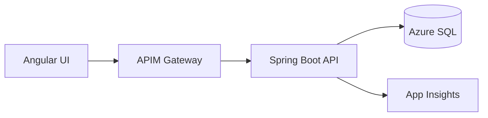

# Azure API-First Microservices POC (AKS + GitHub Actions)

## Architecture

A collection of detailed C4 and DDD diagrams is available in [docs/architecture-diagrams.md](docs/architecture-diagrams.md). The high-level flow below summarizes the main interaction path.



## Tech Stack

Angular 17 · Java 17 · Spring Boot 3 · Azure SQL · Azure AD JWT · AKS · APIM · App Insights · GitHub Actions

## Solution Overview

This proof-of-concept demonstrates an API-first architecture with Azure-native services. The Spring Boot backend exposes a secure REST API driven by an OpenAPI contract, with Azure AD protecting all endpoints and Micrometer publishing metrics to Prometheus and Azure Application Insights. The Angular frontend authenticates with Azure AD, calls the API via APIM, and visualizes user data, audit logs, and health metrics. GitHub Actions orchestrates CI/CD to build Docker images, push them to GHCR, and deploy to Azure Kubernetes Service.

## Repository Layout

```
backend/   # Spring Boot REST API with security, auditing, observability
frontend/  # Angular UI authenticating with Azure AD and calling the API
manifests/ # Kubernetes deployment, service, ingress, configmap, secret
ci-cd/     # GitHub Actions workflow for AKS deployment
openapi/   # Contract-first API specification powering APIM and Springdoc
```

## Getting Started

1. **Backend**
   ```bash
   cd backend
   mvn spring-boot:run
   ```
   Use a JDK 17 runtime (e.g., set `JAVA_HOME` to a Java 17 installation) so the build can compile Java record classes used by the service.
2. **Frontend**
   ```bash
   cd frontend
   npm install
   npm start
   ```
3. **Docker Images**
   ```bash
   docker build -t ghcr.io/<user>/backend:latest backend
   docker build -t ghcr.io/<user>/frontend:latest frontend
   ```
4. **Kubernetes Deployment**
   ```bash
   kubectl apply -f manifests/
   kubectl get pods -n api-first-demo
   ```

## Run the Demo Locally

You can run the full stack locally without any Azure infrastructure. Open two terminals and follow the steps below.

1. **Start the Spring Boot backend**
   ```bash
   cd backend
   export AZURE_ACTIVEDIRECTORY_ENABLED=false
   mvn spring-boot:run
   ```
   The service runs on <http://localhost:8080>. This `AZURE_ACTIVEDIRECTORY_ENABLED` flag disables Azure AD integration for local testing. With Azure AD disabled it serves sample data from the in-memory H2 database, so you can hit endpoints such as `http://localhost:8080/api/v1/users` directly while iterating locally.

2. **Start the Angular frontend**
   ```bash
   cd frontend
   npm install
   npm start
   ```
   The UI is available on <http://localhost:4200> and is preconfigured to call the backend at `http://localhost:8080/api`.

3. **(Optional) Re-enable Azure AD**

   When you are ready to validate authentication, unset `AZURE_ACTIVEDIRECTORY_ENABLED` and export your Azure tenant values before starting the backend:

   ```bash
   unset AZURE_ACTIVEDIRECTORY_ENABLED
   export AZURE_TENANT_ID=<tenant-guid>
   export AZURE_CLIENT_ID=<app-registration-client-id>
   export AZURE_ALLOWED_GROUPS=ADMIN,USER
   mvn spring-boot:run
   ```

   With Azure AD enabled you must supply a valid bearer token in the `Authorization` header when calling the API or using the frontend.

## Security

* Azure AD-protected APIs using JWT bearer tokens.
* Role-based method security (`ADMIN`, `USER`).
* Secrets stored in Kubernetes secrets and Azure Key Vault (via configuration annotations).

## Observability

* Micrometer + Prometheus endpoint via `/actuator/prometheus`.
* Azure Monitor OpenTelemetry exporter wired to Application Insights.
* Custom `AuditLogInterceptor` captures every request and surfaces a REST audit stream.

## CI/CD Pipeline

* GitHub Actions workflow (`ci-cd/github-actions-aks.yml`) builds the backend and frontend.
* Images pushed to GitHub Container Registry.
* `azure/login` + `aks-set-context` deploy manifests to AKS.
* Rollout verification ensures healthy deployments.

## Verify

* `GET /api/v1/users` → 200 OK
* `GET /api/v1/audit` → audit trail
* App Insights metrics visible

## Enhancements

* Add Service Bus for async events
* Add Helm chart for manifests
* Integrate APIM for rate limiting
