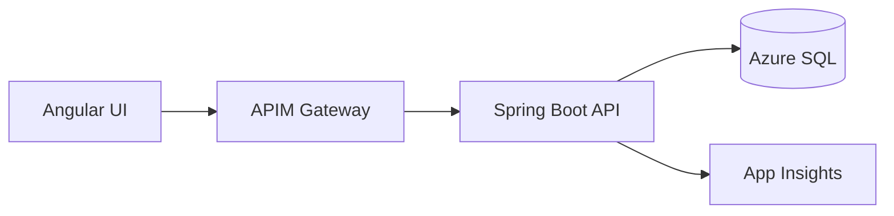

# Azure API-First Microservices POC (AKS + GitHub Actions)

## Architecture


## Tech Stack

Angular 17 · Java 17 · Spring Boot 3 · Azure SQL · Azure AD JWT · AKS · APIM · App Insights · GitHub Actions

## Solution Overview

This proof-of-concept demonstrates an API-first architecture with Azure-native services. The Spring Boot backend exposes a secure REST API driven by an OpenAPI contract, with Azure AD protecting all endpoints and Micrometer publishing metrics to Prometheus and Azure Application Insights. The Angular frontend authenticates with Azure AD, calls the API via APIM, and visualizes user data, audit logs, and health metrics. GitHub Actions orchestrates CI/CD to build Docker images, push them to GHCR, and deploy to Azure Kubernetes Service.

## Repository Layout

```
backend/   # Spring Boot REST API with security, auditing, observability
frontend/  # Angular UI authenticating with Azure AD and calling the API
manifests/ # Kubernetes deployment, service, ingress, configmap, secret
ci-cd/     # GitHub Actions workflow for AKS deployment
openapi/   # Contract-first API specification powering APIM and Springdoc
```

## Getting Started

1. **Backend**
   ```bash
   cd backend
   mvn spring-boot:run
   ```
2. **Frontend**
   ```bash
   cd frontend
   npm install
   npm start
   ```
3. **Docker Images**
   ```bash
   docker build -t ghcr.io/<user>/backend:latest backend
   docker build -t ghcr.io/<user>/frontend:latest frontend
   ```
4. **Kubernetes Deployment**
   ```bash
   kubectl apply -f manifests/
   kubectl get pods -n api-first-demo
   ```

## Security

* Azure AD-protected APIs using JWT bearer tokens.
* Role-based method security (`ADMIN`, `USER`).
* Secrets stored in Kubernetes secrets and Azure Key Vault (via configuration annotations).

## Observability

* Micrometer + Prometheus endpoint via `/actuator/prometheus`.
* Azure Monitor OpenTelemetry exporter wired to Application Insights.
* Custom `AuditLogInterceptor` captures every request and surfaces a REST audit stream.

## CI/CD Pipeline

* GitHub Actions workflow (`ci-cd/github-actions-aks.yml`) builds the backend and frontend.
* Images pushed to GitHub Container Registry.
* `azure/login` + `aks-set-context` deploy manifests to AKS.
* Rollout verification ensures healthy deployments.

## Verify

* `GET /api/v1/users` → 200 OK
* `GET /api/v1/audit` → audit trail
* App Insights metrics visible

## Enhancements

* Add Service Bus for async events
* Add Helm chart for manifests
* Integrate APIM for rate limiting
