## 📘 **Doc 2 — Azure Data Pipeline Design (Mainframe → Azure Health Insurance Data Platform)**

### 🧭 **Purpose**

To design a **secure, scalable, and compliant data ingestion + processing + serving pipeline** for mainframe-origin health-insurance datasets (high-volume, multi-format, regulated PII/PHI).

---

## 🧩 **1️⃣ Business Context**

| Aspect             | Detail                                                           |
| ------------------ | ---------------------------------------------------------------- |
| **Source System**  | Legacy Mainframe (COBOL VSAM files / flat feeds / MQ topics)     |
| **Data Domain**    | Health Insurance Claims, Member Eligibility, Provider Networks   |
| **Volume**         | TB-scale daily batches + high-frequency event feeds              |
| **Latency Needs**  | Near-real-time (< 5 min) for updates; batch for historical loads |
| **Regulations**    | HIPAA, PHIPA (Canada), SOC 2, ISO 27001                          |
| **Cloud Platform** | Microsoft Azure (enterprise tenant)                              |

---

## ⚙️ **2️⃣ Ingestion Architecture — Dual Path**

| Path          | Purpose                                                          | Key Services                                                     |
| ------------- | ---------------------------------------------------------------- | ---------------------------------------------------------------- |
| **Streaming** | Near-real-time member events, eligibility changes, claim updates | **Event Hubs → Stream Analytics / Azure Functions → ADLS (raw)** |
| **Batch**     | Nightly mainframe extracts (VSAM/CSV/JSON)                       | **Data Factory (Azure Integration Runtime) → ADLS**              |

---

## 🧠 **3️⃣ End-to-End Flow Overview**

```mermaid
flowchart LR
  SRC["🏛️ Mainframe Data<br/>(VSAM / Flat files / MQ)"]
  EH["⚡ Event Hubs"]
  SA["🧮 Stream Analytics / Functions"]
  RAW["🗂️ ADLS Gen2 /raw"]
  DBX["🧱 Databricks (Delta Lake – Bronze/Silver/Gold)"]
  SYN["🧭 Synapse Serverless SQL"]
  COS["🪐 Cosmos DB (Serving Layer)"]
  ACS["🔍 Azure Cognitive Search"]

  SRC --> EH
  EH --> SA
  SA --> RAW
  RAW --> DBX
  DBX --> SYN
  DBX --> COS
  COS --> ACS
```

---

## 📂 **4️⃣ Data Contracts & Layout**

| Zone              | Storage Path                                                                | Format & Schema Example                                                                            |
| ----------------- | --------------------------------------------------------------------------- | -------------------------------------------------------------------------------------------------- |
| **Landing / Raw** | `/raw/YYYY/MM/DD/`                                                          | Parquet partitioned by `publish_date`; columns = `id`, `source`, `title`, `body`, `topics[]`, `ts` |
| **Bronze**        | `/bronze/`                                                                  | Auto-ingested raw Delta; schema evolution on read                                                  |
| **Silver**        | `/silver/`                                                                  | Cleaned, deduped, validated records                                                                |
| **Gold**          | `/gold/`                                                                    | Aggregated business views for Synapse & Cosmos                                                     |
| **Format**        | Parquet / Delta Lake (OPTIMIZE small files, Z-ORDER by `source` or `topic`) |                                                                                                    |

---

## ⚙️ **5️⃣ Data Processing Logic**

| Layer                | Engine                                                             | Logic |
| -------------------- | ------------------------------------------------------------------ | ----- |
| **Stream Analytics** | SQL rules for filtering & window aggregations                      |       |
| **Azure Functions**  | Custom UDFs for complex rules (e.g. PII masking, HL7 parsing)      |       |
| **Databricks**       | Spark transformations → Delta Lake bronze/silver/gold              |       |
| **Synapse**          | Ad-hoc reporting via serverless SQL views                          |       |
| **Cosmos DB**        | Serving API for apps / dashboards (JSON documents)                 |       |
| **Cognitive Search** | Full-text indexing on Cosmos change feed for near-real-time search |       |

---

## 🔐 **6️⃣ Security & Compliance Controls**

| Domain                    | Azure Service                                      | Implementation                            |
| ------------------------- | -------------------------------------------------- | ----------------------------------------- |
| **Identity & Access**     | Azure AD, RBAC, PIM                                | Least-privilege roles, managed identities |
| **Network Security**      | Private Endpoints, VNet Integration, NSGs          | All services in private subnets           |
| **Data Encryption**       | SSE + CMK (Key Vault)                              | Keys rotated every 90 days                |
| **PII Protection**        | Data Masking in Functions + Purview classification | Enforced via policy                       |
| **Audit & Lineage**       | Azure Purview                                      | Tracks data from source to consumption    |
| **Compliance Monitoring** | Defender for Cloud + Security Center               | Continuous HIPAA/SOC2 assessment          |

---

## 📊 **7️⃣ Data Serving & Analytics**

| Target                     | Use Case                              | Access Pattern                                                                               |
| -------------------------- | ------------------------------------- | -------------------------------------------------------------------------------------------- |
| **Synapse Serverless SQL** | Ad-hoc analyst queries                | `SELECT TOP 50 * FROM OPENROWSET(BULK 'https://<storage>/gold/*.parquet', FORMAT='PARQUET')` |
| **Cosmos DB**              | Low-latency API reads (< 1 s)         | Claims summary / eligibility lookups                                                         |
| **Cognitive Search**       | Text / semantic search on Cosmos feed | Provider / member keyword lookup                                                             |

---

## ⚡ **8️⃣ Streaming SLOs**

| Metric                       | Target        | Notes                                         |
| ---------------------------- | ------------- | --------------------------------------------- |
| **Ingestion Throughput**     | ≥ 50 K msgs/s | Event Hubs partition tuning                   |
| **Ingestion Lag**            | ≤ 1 min       | Stream Analytics window config                |
| **Delta Compaction Cadence** | Hourly        | Databricks OPTIMIZE job                       |
| **p95 Query Latency**        | < 1 s         | Indexed fields in Cosmos                      |
| **Index Freshness**          | < 5 min       | Cosmos change feed → Cognitive Search indexer |

---

## 🧰 **9️⃣ Governance & Operations**

* **Azure Purview** → data catalog + lineage across zones
* **Key Vault** → secret rotation & audit logs
* **ADF / Databricks Jobs** → integrated with Monitor for alerts
* **App Insights / Log Analytics** → job success/failure tracking
* **Terraform / Bicep IaC** → reproducible infrastructure

---

## 💰 **🔟 Cost & Scalability Considerations**

| Layer            | Cost Driver           | Optimization Tips                               |
| ---------------- | --------------------- | ----------------------------------------------- |
| Event Hubs       | Throughput Units      | Auto-inflate scaling + archive retention 7 days |
| ADLS Gen2        | Storage + I/O         | Lifecycle rules (archive raw after 30 days)     |
| Databricks       | Cluster runtime hours | Job clusters + spot instances                   |
| Synapse          | Query volume          | Use serverless pay-per-TB scanned               |
| Cosmos DB        | RU/s                  | Partition by memberId or claimId; autoscale     |
| Cognitive Search | Index size            | Tier down non-active indexes                    |

---

## 🧠 **🔟 Extensibility & Future Enhancements**

* Integrate **Azure Machine Learning** for fraud detection / claim anomaly models
* Add **Data Share** for secure partner exchange
* Deploy **Purview Policies** for sensitive data auto-masking
* Implement **CI/CD for Data Pipeline** via Azure DevOps Releases
* Support **Delta Live Tables / Fabric Lakehouse** for unified governance

---

## 🧱 **Summary Diagram (Architecture Layers)**

| Layer          | Key Services                            | Primary Goal                   |
| -------------- | --------------------------------------- | ------------------------------ |
| **Ingestion**  | Event Hubs, Data Factory                | Reliable stream + batch ingest |
| **Storage**    | ADLS Gen2 (raw/bronze/silver/gold)      | Durable data lake              |
| **Processing** | Stream Analytics, Functions, Databricks | Real-time + batch ETL          |
| **Serving**    | Synapse, Cosmos DB, Cognitive Search    | Query / API / Search           |
| **Governance** | Purview, Key Vault, Defender for Cloud  | Compliance + security          |

---