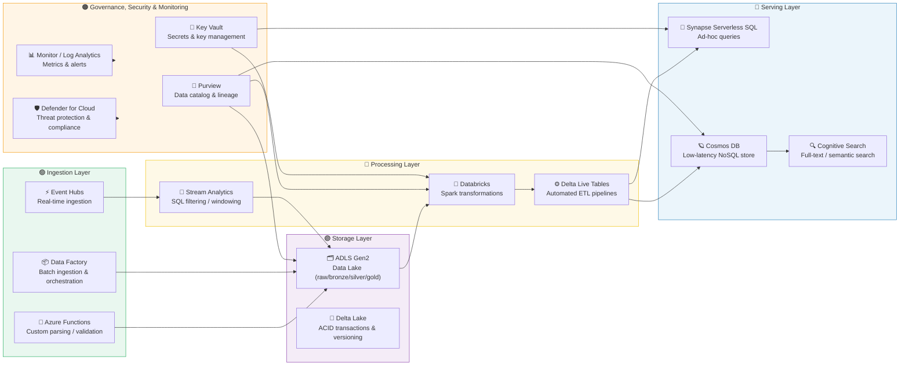

### 🧩 **Mermaid Diagram — Azure Data Platform Component Map**

---

### 🧠 **How to Read It**

1️⃣ **Ingestion Layer** → Event Hubs, Data Factory, and Functions bring data from the mainframe in both streaming and batch modes.  
2️⃣ **Storage Layer** → ADLS Gen2 acts as the central data lake, storing Parquet and Delta Lake versions of all datasets.  
3️⃣ **Processing Layer** → Stream Analytics filters quick signals, and Databricks transforms the large data into curated Delta tables.  
4️⃣ **Serving Layer** → Synapse, Cosmos DB, and Cognitive Search expose data via SQL, APIs, and full-text search.  
5️⃣ **Governance Layer** → Purview tracks data lineage, Key Vault secures secrets, Defender enforces compliance, and Monitor tracks uptime, lag, and cost.  

---