## 🧩 **1️⃣ Data Sources — Beyond Mainframe**

| Source Type                          | Example Systems / Data                                          | Format                                | Ingestion Method                          | Landing Zone                 |
| ------------------------------------ | --------------------------------------------------------------- | ------------------------------------- | ----------------------------------------- | ---------------------------- |
| **Mainframe Feeds**                  | COBOL/VSAM exports, batch files (claims, members, policies)     | Flat file (CSV, EBCDIC → UTF-8), JSON | Azure Data Factory (batch), SFTP          | `/raw/mainframe/YYYY/MM/DD`  |
| **Event Streams**                    | Claim status updates, new enrollments, policy renewals          | JSON messages                         | Event Hubs (streaming)                    | `/raw/events/YYYY/MM/DD`     |
| **Operational Databases**            | On-prem or cloud SQL / Oracle / PostgreSQL                      | Table snapshots / CDC                 | ADF Copy Activity / Dataflows / Azure DMS | `/raw/rdbms/YYYY/MM/DD`      |
| **APIs / Webhooks**                  | Partner systems (TPA, pharmacy benefit managers, IoT devices)   | JSON payloads                         | Logic Apps / Event Grid → Event Hubs      | `/raw/api/YYYY/MM/DD`        |
| **Documents / Attachments**          | Scanned EOBs, claim forms, PDFs, HL7 / FHIR XML                 | Binary / XML / JSON                   | Functions + Blob Storage                  | `/raw/documents/YYYY/MM/DD`  |
| **Third-Party Feeds**                | Provider registries, demographics, healthcare news, market data | CSV / JSON                            | ADF Pipelines or REST connectors          | `/raw/thirdparty/YYYY/MM/DD` |
| **Streaming IoT / Device Data**      | Remote patient monitoring devices, vitals sensors               | JSON, Avro                            | Event Hubs or IoT Hub                     | `/raw/iot/YYYY/MM/DD`        |
| **Manual Uploads / One-Off Imports** | Ad-hoc analyst uploads, backfill datasets                       | CSV / Excel                           | Azure Storage Explorer → ADLS             | `/raw/manual/YYYY/MM/DD`     |

---

## 🧠 **2️⃣ How These Fit into the Architecture**

Below is the **expanded flow**, showing multiple source types feeding into the same unified pipeline.

```mermaid
flowchart LR
    MF["🏛️ Mainframe<br/>Batch Extracts"]
    DB["🗄️ RDBMS / SQL / Oracle"]
    API["🌐 Partner APIs / Webhooks"]
    EVT["⚡ Event Streams (real-time)"]
    IOT["📡 IoT Devices / Sensors"]
    DOC["🗂️ Documents (PDF / XML)"]

    ADF["📦 Data Factory<br/>Batch Ingestion"]
    EH["⚡ Event Hubs<br/>Streaming Ingestion"]
    FN["🧩 Azure Functions<br/>Parsing / Masking / Validation"]
    ADLS["🗂️ ADLS Gen2<br/>Data Lake /raw"]
    DBX["🚀 Databricks<br/>Delta Lake ETL"]
    SYN["🧭 Synapse SQL"]
    COS["🪐 Cosmos DB"]

    MF --> ADF
    DB --> ADF
    API --> EH
    EVT --> EH
    IOT --> EH
    DOC --> FN
    ADF --> ADLS
    EH --> FN
    FN --> ADLS
    ADLS --> DBX
    DBX --> SYN
    DBX --> COS
```

---

## ⚙️ **3️⃣ How We Handle Each Type in the Pipeline**

| Source Type                        | Latency           | Transformation                     | Typical Use Case                       |
| ---------------------------------- | ----------------- | ---------------------------------- | -------------------------------------- |
| **Batch (Mainframe, RDBMS)**       | Hours → Daily     | Full extract or incremental CDC    | Historical claim load                  |
| **Streaming (Event Hubs)**         | Seconds           | Light parsing + enrichment         | Real-time claim status, member updates |
| **APIs (Event Grid / Logic Apps)** | Seconds → Minutes | JSON flattening, schema validation | Partner events or FHIR updates         |
| **Documents**                      | On upload         | OCR / Metadata extraction          | Claim attachments, scanned forms       |
| **Third-party Feeds**              | Daily / Weekly    | Join with internal data            | Provider lists, market insights        |

---

## 🧠 **4️⃣ Why This Multi-Source Strategy Matters**

* Ensures the platform **isn’t locked to mainframe modernization** alone.
* Supports **incremental migration** — mainframe today, cloud-native events tomorrow.
* Enables **real-time analytics** (e.g., eligibility status dashboards).
* Preserves **batch reliability** for regulatory or reconciliation workloads.
* Maintains **cost efficiency** — only real-time data that needs it flows through streaming.

---

## 💡 **5️⃣ Scalability & Governance Implications**

| Concern               | Approach                                                                 |
| --------------------- | ------------------------------------------------------------------------ |
| **Schema Diversity**  | Standardize using JSON Schema / Avro contracts per source                |
| **Volume Handling**   | Auto-scale Event Hubs / parallelize ADF copy activity                    |
| **Security**          | Private endpoints for SFTP, API connectors; PII masking at Functions     |
| **Compliance**        | Tag data lineage per source in Purview (mainframe, IoT, third-party)     |
| **Cost Optimization** | Hot/cold storage lifecycle rules in ADLS + Event Hubs auto-inflate units |

---

So yes — the design already **accommodates other data sources** beyond mainframe:
Event-driven, batch, API-based, document-based, and IoT — all flowing into the same **ADLS → Delta Lake → Synapse / Cosmos / Search** backbone.
