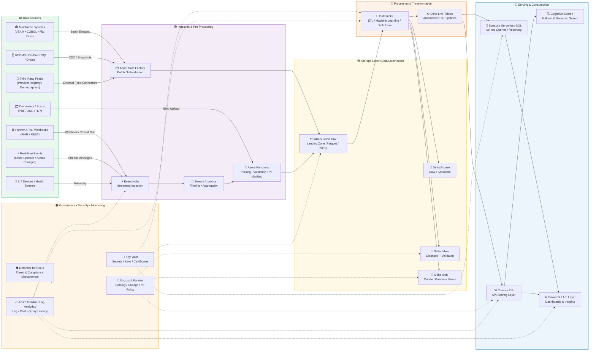

### 🧭 **Mermaid Diagram — End-to-End Azure Data Flow (Multi-Source Design)**

---

### 🧠 **Step-by-Step Data Movement**

| Step                              | Stage                                        | Description                                                                     | Azure Services                        |
| --------------------------------- | -------------------------------------------- | ------------------------------------------------------------------------------- | ------------------------------------- |
| **1️⃣ Ingest Data**               | From Mainframe, APIs, IoT, and Events        | Batch → ADF, Streaming → Event Hubs, Webhooks → Event Grid                      | Data Factory, Event Hubs, Event Grid  |
| **2️⃣ Pre-Process & Validate**    | Apply filters, masking, and parsing          | Stream Analytics for basic SQL filters; Functions for custom logic              | Stream Analytics, Functions           |
| **3️⃣ Land Raw Data**             | Store unprocessed data in Data Lake          | All data lands in ADLS Gen2 `/raw` with partitions by date                      | ADLS Gen2                             |
| **4️⃣ Process & Transform**       | ETL into structured, governed datasets       | Databricks cleans, deduplicates, joins → creates Delta Lake layers              | Databricks, Delta Live Tables         |
| **5️⃣ Serve for Analytics**       | Query-ready gold datasets                    | Synapse (ad-hoc SQL), Cosmos DB (API apps), Cognitive Search (text)             | Synapse, Cosmos DB, Cognitive Search  |
| **6️⃣ Deliver Business Insights** | Dashboards and KPIs                          | Power BI connected to Synapse/Cosmos for visual analytics                       | Power BI                              |
| **7️⃣ Govern & Monitor**          | Track lineage, secrets, compliance, and cost | Purview (catalog), Key Vault (secrets), Defender (compliance), Monitor (alerts) | Purview, Key Vault, Defender, Monitor |

---

### ⚡ **Performance Checkpoints (SLOs)**

| Metric                                 | Target            | Monitored In               |
| -------------------------------------- | ----------------- | -------------------------- |
| **Streaming Lag**                      | < 60 seconds      | Azure Monitor → Event Hubs |
| **Batch Load Window**                  | < 2 hours nightly | ADF run history            |
| **Delta Compaction Cadence**           | Hourly            | Databricks Job Cluster     |
| **p95 Query Latency (Synapse/Cosmos)** | < 1 second        | Log Analytics              |
| **Index Freshness (Cognitive Search)** | < 5 minutes       | Indexer Health             |
| **Lineage Visibility**                 | 100% traceable    | Purview scans              |
| **Key Rotation**                       | Every 90 days     | Key Vault audit logs       |

---

### 🧩 **Why This Design Works**

✅ **Modular** — new data sources can plug in easily.
✅ **Scalable** — supports TB/day ingestion and real-time events.
✅ **Secure** — full encryption, masking, private endpoints, compliance guardrails.
✅ **Unified Storage** — ADLS Gen2 + Delta Lake ensures reliability and ACID transactions.
✅ **Flexible Consumption** — both SQL (Synapse) and API (Cosmos) layers.
✅ **Governed** — lineage, auditability, and security built-in.

---
