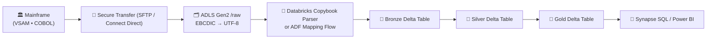

## 🧩 **1️⃣ Ingestion — Getting Data Out of Mainframe**

| Step                             | Tool / Method                                              | What Happens                                                               | Notes                              |
| -------------------------------- | ---------------------------------------------------------- | -------------------------------------------------------------------------- | ---------------------------------- |
| **a. Data Extraction (on-prem)** | IBM DFSORT / JCL Jobs / IBM Connect Direct / FTP (SFTP)    | Nightly COBOL/VSAM data exported as **flat files** or **JSON/XML**.        | Sometimes zipped or tarred.        |
| **b. Format Conversion**         | **IBM DataStage** or **Azure Data Factory Self-Hosted IR** | Converts **EBCDIC → UTF-8** and **fixed-width → Delimited (Parquet/CSV)**. | Use schema mapping from copybooks. |
| **c. Transfer to Cloud**         | **SFTP → Blob Storage / ADLS Gen2 /raw**                   | Files uploaded securely via **SAS token** or **Private Endpoint**.         | Triggers downstream processing.    |

✅ **Result:** Mainframe dumps land as **raw, UTF-8, delimited files** in `/raw/mainframe/YYYY/MM/DD`.

---

## ⚙️ **2️⃣ Schema & Metadata Extraction**

### Option A — COBOL Copybook Parser

* Use **ADF Mapping Data Flow** or **Databricks Copybook Library**:

  ```python
  from com.databricks.spark.avro import CobolParser
  df = CobolParser.read("policy.cpy").fromText("input.dat")
  df.write.format("parquet").save("/raw/mainframe_parsed/")
  ```
* Auto-converts fixed-width into columns using COBOL schema.
* Handles PIC clauses, COMP-3 fields, decimals, etc.

### Option B — Flat File Definition Table

* Maintain a JSON schema describing each file layout.
* Azure Data Factory can map fields dynamically.

✅ **Goal:** End up with *structured Parquet files* in `/bronze/mainframe/…`.

---

## 🧮 **3️⃣ Data Cleansing & Transformation**

| Type               | Technology                       | Example                                             |
| ------------------ | -------------------------------- | --------------------------------------------------- |
| **Basic rules**    | Azure Data Factory Data Flows    | Filter invalid records, cast data types.            |
| **Heavy ETL**      | Azure Databricks (Spark)         | Deduplicate, join reference data, enrich claims.    |
| **Business rules** | Delta Live Tables (Databricks)   | Apply claim eligibility logic, normalize code sets. |
| **Anonymization**  | Azure Functions / Databricks UDF | Mask SSN, DOB, and other PHI fields.                |

✅ Bronze → Silver → Gold Delta tables created in ADLS Gen2.

---

## 🔄 **4️⃣ Automation & Orchestration**

* **Azure Data Factory Pipeline:**

    1. SFTP copy → ADLS /raw
    2. Databricks notebook → ETL job
    3. Validation + Notifications

* **Delta Live Tables:** Automates incremental processing, CDC, and audit logging.

* **Azure Synapse Pipeline:** Alternative if you prefer SQL-centric orchestration.

---

## 📊 **5️⃣ Consumption & Analytics**

* **Synapse Serverless SQL** — ad-hoc queries on `/gold/mainframe/*.parquet`
* **Power BI / API Layer** — interactive dashboards on processed data
* **Cosmos DB / Search** — indexed subset for low-latency access

---

## 🧠 **6️⃣ Governance & Compliance**

| Concern                      | Mechanism                                                   |
| ---------------------------- | ----------------------------------------------------------- |
| **Lineage & Cataloging**     | Microsoft Purview auto-scans ADLS and Delta tables.         |
| **Secrets / Keys**           | Azure Key Vault secures SFTP credentials, storage keys.     |
| **Audit & Monitoring**       | Azure Monitor + App Insights track pipeline latency & cost. |
| **HIPAA / PHIPA Compliance** | All PII masked; private endpoints enforced.                 |

---

## 📘 **In Summary — Mainframe Data Path**



---

### 🔑 **Key Takeaways**

* ✅ Extract using **IBM Connect Direct or ADF IR**  
* ✅ Convert **EBCDIC → UTF-8**, **fixed-width → Parquet**  
* ✅ Use **Databricks Copybook Parser** for schema alignment
* ✅ Clean / mask / join → Delta Lake (Bronze/Silver/Gold)
* ✅ Query via **Synapse SQL** or **Power BI**

