## 🧩 **Mainframe vs Modern Data Source — Azure Data Pipeline Comparison**

| Dimension                     | 🏛️ **Mainframe Data (Legacy Systems)**                  | ☁️ **Modern Data Sources (APIs, Events, IoT, RDBMS, Files)**  |
| ----------------------------- | -------------------------------------------------------- | ------------------------------------------------------------- |
| **Origin**                    | On-prem mainframe (COBOL / VSAM / CICS)                  | Cloud apps, APIs, RDBMS, event-driven systems                 |
| **Format**                    | Fixed-width, EBCDIC encoding, COBOL copybook schema      | JSON, CSV, Parquet, Avro, or XML                              |
| **Transfer Mechanism**        | Secure FTP (Connect:Direct, SFTP) or tape dump           | REST API, Event Hub, IoT Hub, direct connectors, streaming    |
| **Frequency**                 | Batch (nightly or weekly exports)                        | Real-time (event-based) or near-real-time micro-batches       |
| **Ingestion Tool**            | Azure Data Factory (Self-Hosted IR) / SFTP Connector     | Event Hubs, IoT Hub, Logic Apps, API Management, ADF Cloud IR |
| **Pre-Processing**            | EBCDIC → UTF-8 conversion, Copybook parsing              | Directly readable formats, simple JSON flattening             |
| **Schema Definition**         | COBOL Copybook or JCL schema mappings                    | JSON Schema, SQL schema, or inferred automatically            |
| **Parser / Transformer**      | Databricks Copybook Parser or ADF Mapping Data Flow      | Databricks, Stream Analytics, Synapse Pipelines, Functions    |
| **Landing Zone**              | `/raw/mainframe/YYYY/MM/DD`                              | `/raw/<source_type>/YYYY/MM/DD`                               |
| **Initial Processing**        | Heavy: type decoding, field trimming, record splitting   | Light: field rename, filter, timestamp normalization          |
| **Transformation Layer**      | Databricks / Delta Live Tables (Bronze → Silver → Gold)  | Same Databricks / Delta flow, lighter transformations         |
| **Data Validation**           | Complex: structure conformance to COBOL copybook         | Schema-based, easily automated                                |
| **Error Handling**            | Manual intervention, reprocess full file                 | Automatic DLQ (Dead Letter Queue) / partial replays           |
| **Governance Metadata**       | Extracted via Purview custom scan or manual registration | Auto-scanned by Purview; schema auto-detected                 |
| **Security**                  | SFTP + private endpoint; PII masking required post-load  | Native Azure AD / OAuth2 / network restrictions               |
| **Compliance Focus**          | HIPAA / PHIPA / SOC2, audit-trace critical               | Same standards, but less manual auditing needed               |
| **Processing Engine**         | Databricks (Spark ETL), ADF batch pipelines              | Stream Analytics, Functions, Databricks, Synapse pipelines    |
| **Storage Format (post-ETL)** | Parquet + Delta Lake                                     | Parquet + Delta Lake                                          |
| **Consumption**               | Synapse SQL, Power BI (aggregated claims/policy views)   | Real-time APIs (Cosmos DB), dashboards, Cognitive Search      |
| **Lineage Tracking**          | Manual setup or Purview custom connector                 | Auto-managed via Purview lineage integration                  |
| **Change Handling (CDC)**     | Entire file replaced nightly                             | Event-driven or incremental CDC (Change Data Capture)         |
| **Performance**               | Optimized for large nightly batch throughput             | Optimized for low-latency streaming and scale-out processing  |
| **Maintenance Complexity**    | High – copybook mapping, format evolution                | Low – schema evolution handled by services                    |
| **Automation Potential**      | Medium – requires metadata-driven pipeline               | High – can trigger workflows on events (ADF, Event Grid)      |

---

## 💡 **Interpretation**

* 🟢 **Mainframe Path:** Focus on **compatibility, conversion, and compliance**.

    * Key tools: **ADF Self-Hosted IR, Databricks Copybook Parser, Delta Lake, Purview.**
* 🔵 **Modern Path:** Focus on **speed, scalability, and automation**.

    * Key tools: **Event Hubs, Functions, Stream Analytics, Cosmos DB, Synapse.**
* Both converge in the **Delta Lake (Bronze → Silver → Gold)** model for unified analytics and governance.

---

## 🧱 **Unified Integration Model**

```mermaid
flowchart LR
    MF["🏛️ Mainframe<br/>(COBOL/VSAM)"]
    API["🌐 APIs / Webhooks"]
    EVT["⚡ Event Streams / IoT"]
    DB["🗄️ RDBMS / SQL"]
    DOC["🗂️ Documents / PDFs"]

    ADF["📦 Data Factory (Batch)"]
    EH["⚡ Event Hubs (Stream)"]
    FN["🧩 Functions / Stream Analytics"]

    ADLS["🗂️ ADLS Gen2 (Data Lake)<br/>/raw → /bronze → /silver → /gold"]
    DBX["🚀 Databricks (ETL / Copybook Parser)"]
    SYN["🧭 Synapse SQL"]
    COS["🪐 Cosmos DB"]

    MF --> ADF --> ADLS
    API --> EH --> FN --> ADLS
    EVT --> EH
    DB --> ADF
    DOC --> ADF
    ADLS --> DBX --> SYN
    ADLS --> DBX --> COS
```

---