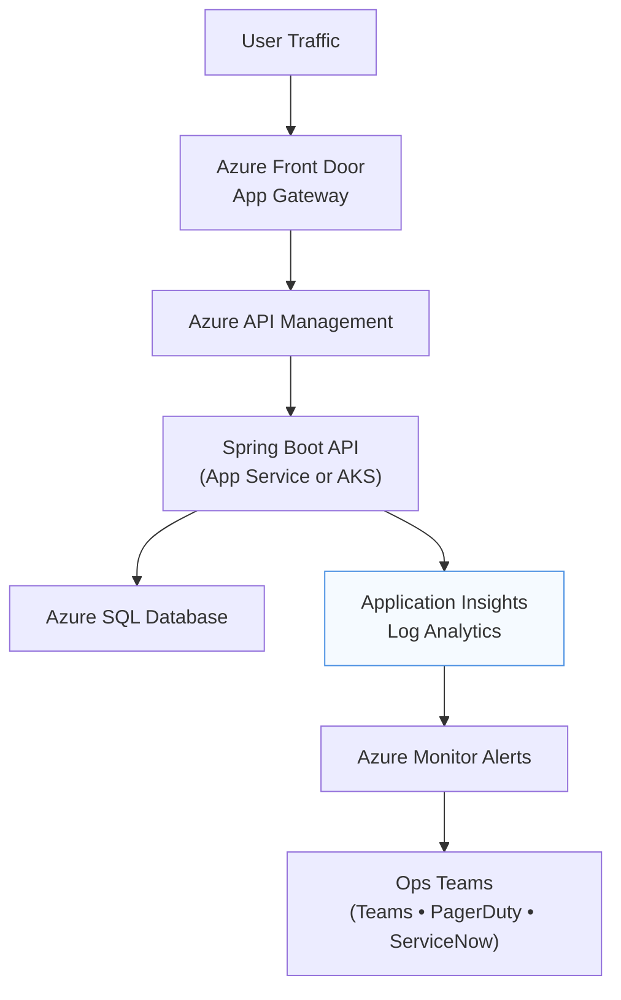
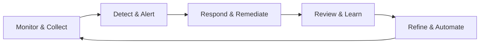

## 📘 **Azure Operations & Monitoring Guide**

### 🧭 Purpose

Provide a clear, role-based framework for **operating, monitoring, and continuously improving** the API-First Platform on Azure after deployment.
Covers service health, alerting, incident response, observability, and cost optimization.

---

## 🧩 1️⃣ Operations Overview

| Area                       | Description                                                                                           |
| -------------------------- | ----------------------------------------------------------------------------------------------------- |
| **Scope**                  | All deployed Azure resources (AKS, App Service, APIM, SQL, Key Vault, App Insights, Front Door)       |
| **Primary Goal**           | Maintain ≥ 99.9 % availability, ensure security compliance and cost efficiency                        |
| **Tool Stack**             | Azure Monitor • Log Analytics • Application Insights • Defender for Cloud • Cost Management + Budgets |
| **Team Roles**             | Cloud Ops (SRE), DevOps, Security Ops, App Support                                                    |
| **Communication Channels** | Teams Ops War Room, ServiceNow Incident Queue, Email Escalation                                       |

---

## ⚙️ 2️⃣ Monitoring Architecture

---

## 🔍 3️⃣ Key Monitoring Components

| Layer           | Azure Service      | Metrics / Logs Tracked                      | Alert Threshold / Action         |
| --------------- | ------------------ | ------------------------------------------- | -------------------------------- |
| **Application** | App Insights       | Request Rate, Failures, Dependency Duration | 5xx > 10/min → Alert to SRE      |
| **API Gateway** | APIM               | Backend Latency, Quota Usage                | Latency > 1 s → Notify API Owner |
| **Compute**     | AKS / App Service  | CPU > 80 %, Pod Restart Count               | Auto-scale via HPA/KEDA          |
| **Database**    | Azure SQL          | DTU %, Deadlocks, IO wait time              | DTU > 85 % → Scale Up            |
| **Security**    | Defender for Cloud | Vulnerabilities, Threat alerts              | Critical → Security Bridge       |
| **Network**     | Front Door, VNet   | Connection Errors, E2E Latency              | > 2 % fail rate → Ops Bridge     |
| **Cost**        | Cost Management    | Daily Spend, Budget Variance                | 10 % over budget → Finance Alert |

---

## 🧠 4️⃣ Logging & Telemetry Practices

| Practice               | Implementation                                                         |
| ---------------------- | ---------------------------------------------------------------------- |
| **Structured Logging** | Use `logger.info("{eventId} {user} {action}")` in Spring Boot          |
| **Trace Correlation**  | Propagate `traceparent` headers from Angular → API                     |
| **Metrics Exporters**  | Micrometer → App Insights / Prometheus                                 |
| **Log Retention**      | 90 days (default) → 365 days for audit logs                            |
| **Custom Events**      | Audit actions (e.g., user create/update) tagged with `eventType=audit` |

---

## 🚨 5️⃣ Alert Lifecycle Management

1️⃣ **Detection** — Alert triggered in Azure Monitor
2️⃣ **Notification** — Teams message + ServiceNow incident
3️⃣ **Triage** — SRE reviews App Insights logs + Kusto query
4️⃣ **Remediation** — Hotfix / Rollback / Scale adjustment
5️⃣ **Post-Incident Review** — RCA within 24 hrs
6️⃣ **Knowledge Update** — Runbook or monitoring rule refined

---

## 🧩 6️⃣ Operational Runbooks & Automation

| Scenario                 | Runbook Location                | Automation Trigger       |
| ------------------------ | ------------------------------- | ------------------------ |
| AKS Node Down            | `/ops/runbooks/aks-recover.md`  | Alert → Logic App        |
| SQL Failover             | `/ops/runbooks/sql-failover.md` | Manual / Budget Window   |
| Key Vault Secret Expired | `/ops/runbooks/kv-rotate.md`    | Event Grid Trigger       |
| High Latency             | `/ops/runbooks/scale-api.md`    | Auto-scale policy (HPA)  |
| Incident RCA             | `/ops/runbooks/rca-template.md` | After ServiceNow closure |

---

## 🔐 7️⃣ Security Operations Integration

* **Defender for Cloud:** continuous assessment + alerts to Security Ops.
* **Sentinel SIEM:** collects App Insights + Audit Logs for threat correlation.
* **Key Vault Access Policies:** rotated every 90 days via Azure Automation.
* **SBOM Monitoring:** GitHub Dependabot + Defender for DevOps.

---

## 💰 8️⃣ Cost & Capacity Governance

| Control                 | Tool                    | Frequency | Owner     |
| ----------------------- | ----------------------- | --------- | --------- |
| Daily Spend Review      | Azure Cost Analysis     | Daily     | Cloud Ops |
| Budget Alerts           | Azure Budgets           | Monthly   | Finance   |
| Autoscale Policy Tuning | AKS / App Service       | Quarterly | DevOps    |
| Right-sizing            | Advisor Recommendations | Quarterly | Architect |

---

## 🔄 9️⃣ Continuous Improvement Cycle

Each quarter, review alerts → update dashboards → add automation to reduce manual intervention.

---

## 🧱 🔟 Roles & Responsibilities

| Role                  | Key Tasks                                              |
| --------------------- | ------------------------------------------------------ |
| **SRE / Cloud Ops**   | 24×7 monitoring, incident response, infra patching     |
| **DevOps Engineer**   | Pipeline maintenance, IaC updates, artifact management |
| **Security Engineer** | Threat detection, compliance reporting                 |
| **Application Team**  | Functional support & bug fixes                         |
| **Architect**         | Governance, cost reviews, improvement roadmap          |

---

## 📦 11️⃣ Deliverables & Dashboards

* `App Insights → Performance Overview`
* `Log Analytics → Error Summary Query`
* `Azure Dashboard → Platform Health`
* `Sentinel → Security Incidents Feed`
* `Cost Management → Budget vs Actual Chart`

---

## ✅ 12️⃣ Sign-off & Audit Trail

| Review Cycle             | Reviewer            | Approved By | Date |
| ------------------------ | ------------------- | ----------- | ---- |
| Monthly Ops Review       | Cloud Ops Lead      |             |      |
| Quarterly Security Audit | Security Officer    |             |      |
| Cost Optimization Review | Architect / Finance |             |      |

---

### 🧾 Appendix (Artifacts to Attach)

* App Insights Dashboards (JSON export)
* Kusto Queries for Error and Latency Trends
* Sample Alert Emails / ServiceNow tickets
* Screenshot of Defender for Cloud Recommendations
* Cost Report PDF (last month)

