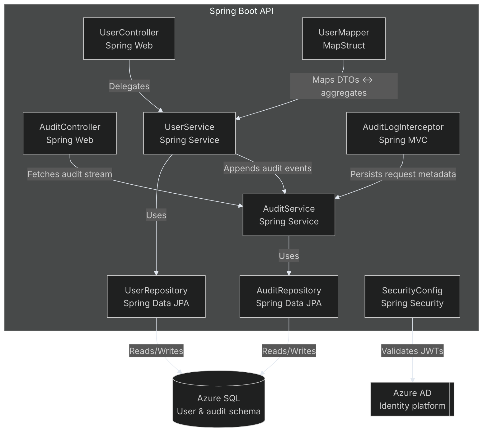
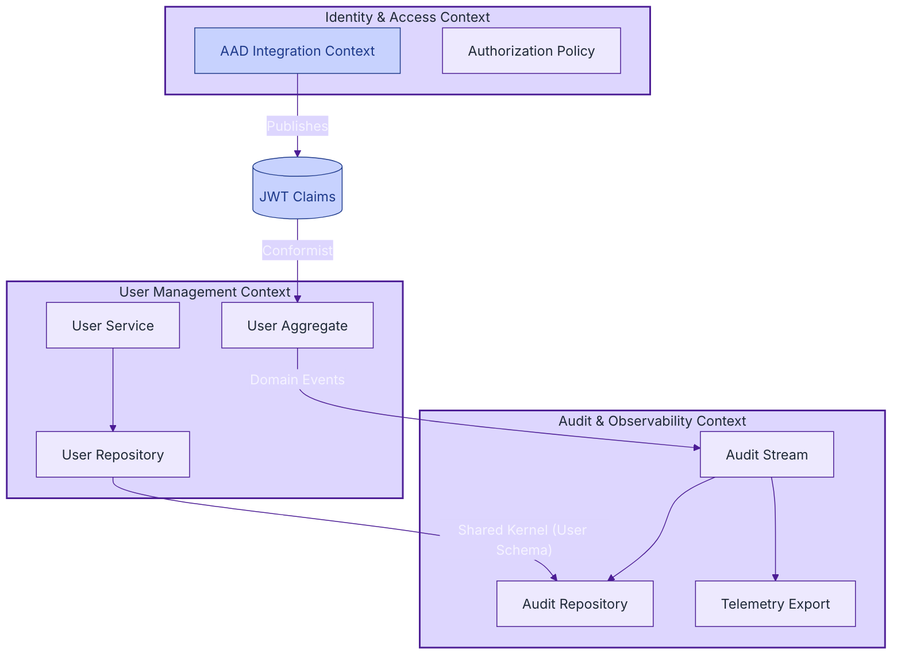
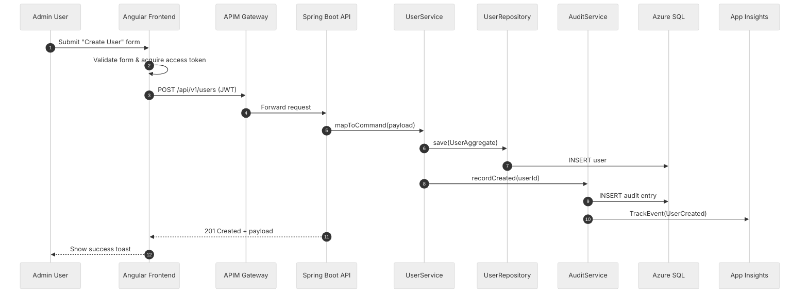

# Architecture Diagrams

This document captures C4-style architecture views and Domain-Driven Design (DDD) bounded contexts for the Azure API-first microservices proof of concept. All diagrams are rendered with Mermaid so they can evolve alongside the codebase.

## Level 1 — System Context

## Level 2 — Container View

## Level 3 — Component View (Spring Boot API)

## DDD Context Map

## Use Case Sequence — "Create User"

These diagrams can be copied into documentation portals or Azure DevOps wikis to communicate the system from multiple viewpoints.
