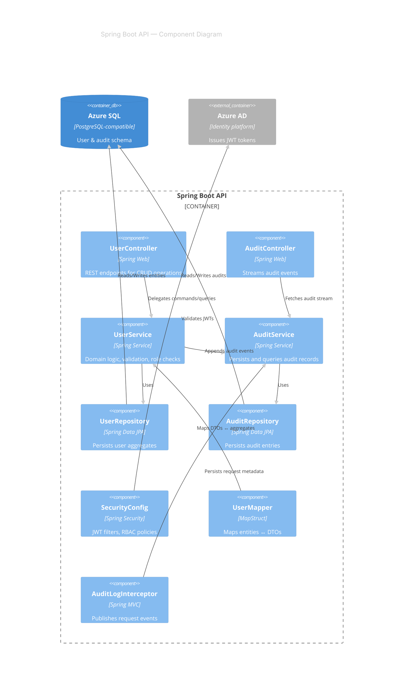
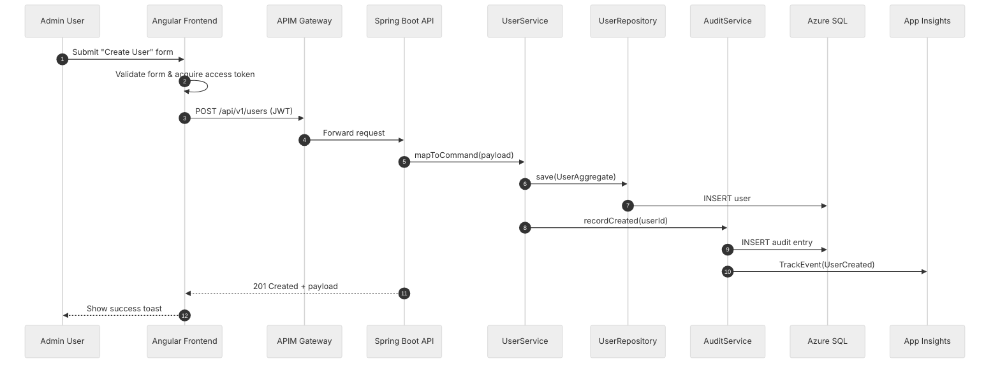

# Architecture Diagrams

This document captures C4-style architecture views and Domain-Driven Design (DDD) bounded contexts for the Azure API-first microservices proof of concept. All diagrams are rendered with Mermaid so they can evolve alongside the codebase.

## Level 1 — System Context

```mermaid
%%{init: {'theme': 'forest', 'themeVariables': { 'fontFamily': 'Inter,Segoe UI,Arial', 'primaryColor': '#0F766E', 'primaryBorderColor': '#115E59', 'primaryTextColor': '#F0FDFA', 'secondaryColor': '#ECFEFF', 'tertiaryColor': '#CCFBF1' }}}%%
C4Context
  title Azure API-First Platform — System Context
  Person(admin, "Admin User", "Manages user accounts and audit insights")
  Person(user, "Standard User", "Reviews own profile and activity")

  System_Ext(azureAD, "Azure Active Directory", "Identity provider issuing JWT tokens")
  System_Ext(apim, "Azure API Management", "Gateway enforcing policies and throttling")
  System_Ext(appInsights, "Azure Application Insights", "Telemetry & observability")

  System_Boundary(core, "API-First Platform") {
    Container_Web(spa, "Angular Frontend", "Angular 17", "Authenticates via Azure AD and invokes APIs")
    Container(api, "Spring Boot API", "Java 17", "User management & audit endpoints")
    ContainerDb(sql, "Azure SQL", "Managed SQL Database", "Persists user records")
    ContainerDb(h2, "H2", "In-memory DB", "Local developer data store")
  }

  Rel(admin, spa, "Uses", "Browser / HTTPS")
  Rel(user, spa, "Uses", "Browser / HTTPS")
  Rel(spa, apim, "Invokes", "HTTPS + JWT")
  Rel(apim, api, "Routes", "HTTPS")
  Rel(api, sql, "Reads/Writes", "JDBC")
  Rel(api, h2, "Reads/Writes", "JDBC (local)")
  Rel(api, appInsights, "Publishes telemetry", "OpenTelemetry")
  Rel(api, azureAD, "Validates tokens", "OAuth 2.0 / OIDC")
  Rel(spa, azureAD, "Obtains tokens", "MSAL.js")
```

## Level 2 — Container View

```mermaid
%%{init: {'theme': 'neutral', 'themeVariables': { 'fontFamily': 'Inter,Segoe UI,Arial', 'primaryColor': '#1D4ED8', 'primaryTextColor': '#F8FAFC', 'lineColor': '#1E293B', 'secondaryColor': '#E0F2FE', 'tertiaryColor': '#F1F5F9' }}}%%
C4Container
  title Azure API-First Platform — Container Diagram
  Person(admin, "Admin")
  Person(user, "End User")

  System_Boundary(core, "Azure API-First Platform") {
    Container(spa, "Angular SPA", "Node + Angular", "User interface, MSAL authentication, UX workflows")
    Container_Boundary(k8s, "AKS Cluster") {
      Container(apimGw, "APIM Self-Hosted Gateway", "Azure APIM", "Enforces policies, routes traffic to services")
      Container(api, "Spring Boot Service", "Java 17 + Spring", "Implements OpenAPI contract, RBAC, auditing")
      Container(otel, "OpenTelemetry Collector", "Azure Monitor", "Forwards traces & metrics")
    }
    ContainerDb(sql, "Azure SQL Database", "PaaS", "Stores users, roles, audit facts")
    Container_Ext(appInsights, "Application Insights", "Azure Monitor", "Collects metrics, logs, traces")
    Container_Ext(keyVault, "Azure Key Vault", "Secrets", "Stores credentials & connection strings")
    Container_Ext(ghActions, "GitHub Actions", "CI/CD", "Builds & deploys containers to AKS")
  }

  Rel(admin, spa, "Manages users/audit dashboards")
  Rel(user, spa, "Views profile & metrics")
  Rel(spa, apimGw, "HTTPS requests", "JWT bearer tokens")
  Rel(apimGw, api, "Routes REST calls")
  Rel(api, sql, "CRUD operations", "JDBC + Liquibase")
  Rel(api, keyVault, "Fetches secrets", "Managed identity")
  Rel(api, otel, "Exports telemetry")
  Rel(otel, appInsights, "Sends traces/metrics")
  Rel(ghActions, k8s, "Applies manifests", "kubectl via OIDC")
```

## Level 3 — Component View (Spring Boot API)



## DDD Context Map

```mermaid
%%{init: {'theme': 'base', 'themeVariables': { 'fontFamily': 'Inter,Segoe UI,Arial', 'primaryColor': '#4C1D95', 'primaryTextColor': '#F5F3FF', 'secondaryColor': '#DDD6FE', 'tertiaryColor': '#EDE9FE', 'lineColor': '#4C1D95' }}}%%
flowchart TD
  subgraph Identity[Identity & Access Context]
    direction TB
    AAD[AAD Integration Context]
    AuthPolicy[Authorization Policy]
  end

  subgraph UserMgmt[User Management Context]
    direction TB
    Aggregate[User Aggregate]
    ServiceLayer[User Service]
    Repo[User Repository]
  end

  subgraph Audit[Audit & Observability Context]
    direction TB
    AuditStream[Audit Stream]
    AuditStore[Audit Repository]
    Metrics[Telemetry Export]
  end

  AAD -->|Publishes| TokenClaims[(JWT Claims)]
  TokenClaims -->|Conformist| Aggregate
  Aggregate -->|Domain Events| AuditStream
  AuditStream --> AuditStore
  AuditStream --> Metrics
  ServiceLayer --> Repo
  Repo -->|Shared Kernel (User Schema)| AuditStore

  classDef boundedContext fill:#DDD6FE,stroke:#4C1D95,stroke-width:2px,color:#1F2937;
  class Identity,UserMgmt,Audit boundedContext;
  classDef integration fill:#C7D2FE,stroke:#1E3A8A,color:#1E3A8A;
  class AAD,TokenClaims integration;
  classDef domain fill:#EDE9FE,stroke:#4C1D95,color:#1F2937;
  class Aggregate,ServiceLayer,Repo,AuditStream,AuditStore,Metrics,AuthPolicy domain;
```

## Use Case Sequence — "Create User"



These diagrams can be copied into documentation portals or Azure DevOps wikis to communicate the system from multiple viewpoints.
