## 🧭 **Big Picture**

✅ **Ingestion:** (you already have this)
Mainframe / APIs / Events / IoT / RDBMS / Documents → **Azure Data Lake Storage Gen2 (/raw)**

✅ **Next stage (your question):**
**Processing layer** — cleans, filters, validates, enriches, joins, aggregates, and outputs ready-to-query data.

---

## ⚙️ **Processing & Filtering Options on Azure**

| Processing Type                                          | Azure Service                                               | Purpose / When to Use                                                                           | Example Use Case                                                                      |
| -------------------------------------------------------- | ----------------------------------------------------------- | ----------------------------------------------------------------------------------------------- | ------------------------------------------------------------------------------------- |
| **Rule-based filtering (real-time)**                     | **Azure Stream Analytics**                                  | SQL-like streaming engine for filtering, joining, or aggregating events in motion.              | “Only forward claim events where status = ‘APPROVED’.”                                |
| **Custom streaming logic**                               | **Azure Functions / Azure Databricks Structured Streaming** | Use C# / Python / Scala for custom filtering, enrichment, PII masking.                          | Parse HL7 or FHIR JSON and remove sensitive identifiers.                              |
| **Batch ETL / Transformations**                          | **Azure Databricks (Apache Spark)**                         | Heavy transformation of large files (Parquet, CSV, JSON). Handles joins, merges, and cleansing. | Join member and claims datasets, derive claim-to-member ratio, store as Delta tables. |
| **Declarative dataflow orchestration**                   | **Azure Data Factory Data Flows**                           | Low-code visual transformations (derived columns, filters, joins).                              | Nightly mainframe extracts → map to standardized schema.                              |
| **SQL-based batch processing**                           | **Azure Synapse Pipelines + Serverless SQL**                | Transform or query directly using T-SQL; ideal for lightweight cleansing or aggregates.         | Create “ClaimsPerProvider” view for reporting.                                        |
| **Data validation / quality rules**                      | **Azure Data Quality (via Purview + Data Factory)**         | Check data completeness, uniqueness, type conformance.                                          | Validate every claim record has policy_id and service_date.                           |
| **Machine-learning based cleansing / anomaly detection** | **Azure ML or Databricks MLlib**                            | Detect duplicates, outliers, or anomalies.                                                      | Identify suspicious claim patterns.                                                   |

---

## 🧩 **Recommended Flow (for your Architecture)**

```mermaid
flowchart LR
    IN["🟢 Ingestion Sources<br/>Mainframe • APIs • IoT • RDBMS • Docs"]
    RAW["🗂️ ADLS Gen2 /raw<br/>Landing Zone (Parquet/CSV/JSON)"]
    SA["🧮 Stream Analytics<br/>Filter / Aggregate Streaming Data"]
    FN["🧩 Azure Functions<br/>Parse HL7 / Mask PII"]
    DBX["🚀 Databricks<br/>Transform / Merge / Cleanse"]
    DLT["⚙️ Delta Live Tables<br/>Bronze ➜ Silver ➜ Gold"]
    SYN["🧭 Synapse SQL<br/>Analytics / Reporting"]
    COS["🪐 Cosmos DB<br/>Serving Layer APIs"]

    IN --> RAW
    RAW --> SA
    SA --> FN
    FN --> DBX
    DBX --> DLT
    DLT --> SYN
    DLT --> COS
```



---

## 🧠 **How Each Layer Works**

| Layer                                | Description                                                                                               | Main Tech                           |
| ------------------------------------ | --------------------------------------------------------------------------------------------------------- | ----------------------------------- |
| **1️⃣ Landing (/raw)**               | Immutable copy of ingested files. Partitioned by date/source.                                             | ADLS Gen2                           |
| **2️⃣ Filtering / Light Processing** | Real-time: Stream Analytics or Functions. Batch: simple ADF mappings.                                     | ASA / Functions / ADF               |
| **3️⃣ Cleansing / Enrichment**       | Standardize schemas, join lookup tables, remove duplicates, mask PII.                                     | Databricks (Spark ETL)              |
| **4️⃣ Delta Bronze → Silver → Gold** | **Bronze:** Raw normalized data  →  **Silver:** Validated + joined →  **Gold:** Aggregated for reporting. | Delta Lake / Databricks             |
| **5️⃣ Serving & Analytics**          | SQL analytics and dashboards.                                                                             | Synapse (Serverless SQL) + Power BI |
| **6️⃣ Real-Time Access APIs**        | APIs or apps query fresh data.                                                                            | Cosmos DB + Cognitive Search        |

---

## 🧱 **Typical Filtering & Reading Techniques**

### 🔹 *Stream Analytics (real-time)*

```sql
SELECT
    ClaimId, MemberId, Amount
INTO
    output_hub
FROM
    input_stream TIMESTAMP BY EventTime
WHERE
    Status = 'APPROVED';
```

### 🔹 *Databricks (batch / semi-structured)*

```python
df = spark.read.format("parquet").load("/raw/claims/")
clean_df = df.filter(df.status == "APPROVED").dropDuplicates(["claim_id"])
clean_df.write.format("delta").mode("overwrite").save("/silver/claims/")
```

### 🔹 *Synapse Serverless (ad-hoc SQL over Data Lake)*

```sql
SELECT TOP 100 claim_id, provider_id, SUM(amount) AS total_amount
FROM OPENROWSET(
    BULK 'https://<storage>/gold/claims/*.parquet',
    FORMAT='PARQUET'
) AS rows
GROUP BY claim_id, provider_id;
```

---

## 🧠 **Choosing the Right Tool**

| Need                            | Best Option                   |
| ------------------------------- | ----------------------------- |
| Real-time event filtering       | Stream Analytics / Functions  |
| Complex ETL / large-scale joins | Databricks (Spark)            |
| SQL-friendly ad-hoc analysis    | Synapse Serverless SQL        |
| Low-code scheduled data prep    | ADF Data Flows                |
| Predictive analytics / scoring  | Databricks ML / Azure ML      |
| Regulatory lineage tracking     | Purview + Delta Lake metadata |

---

## 🔒 **Security & Compliance During Processing**

* **Access Control:** Use RBAC + ACLs in ADLS Gen2.
* **Encryption:** Data encrypted at rest and in transit.
* **Masking:** Functions or Databricks jobs redact PII columns early.
* **Lineage:** Purview tracks transformations from raw → gold.
* **Private Endpoints:** Secure integration between Databricks, Synapse, and storage.

---

## ⚡ **Final Summary**

👉 **Filtering:** Stream Analytics (simple) + Functions / Databricks (complex)  
👉 **Reading:** Synapse Serverless SQL or Databricks Delta tables  
👉 **Processing:** Databricks + Delta Live Tables for all heavy lifting  
👉 **Governance:** Purview for lineage and compliance  