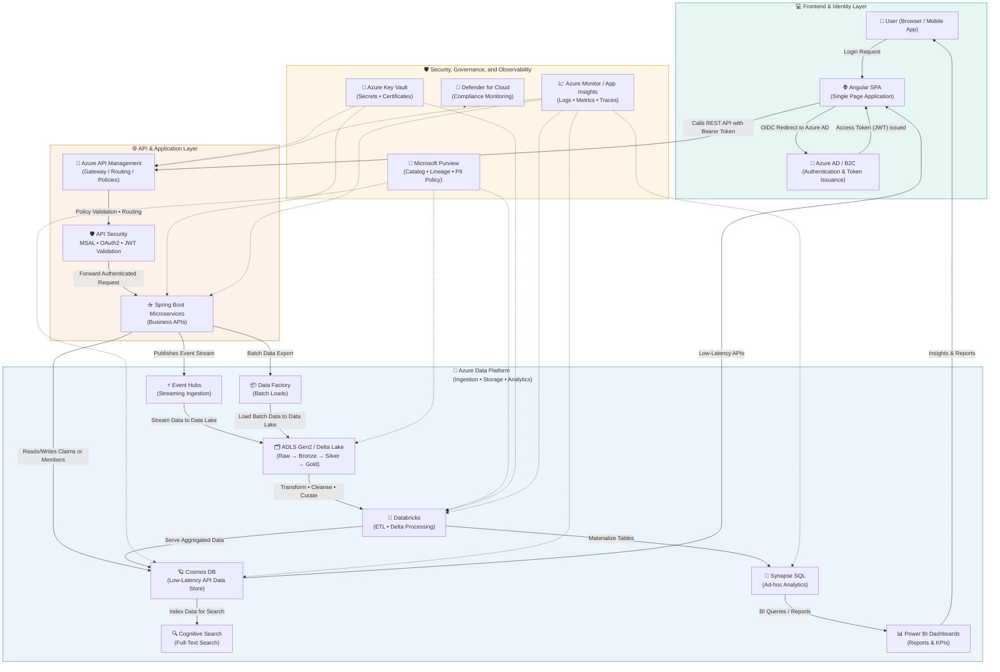

Ahh — got it 🎯 — you’re asking for a **true enterprise end-to-end architecture**, from **user login (Angular SPA)** → **authentication (Azure AD / MSAL)** → **API Gateway (APIM)** → **microservices layer (Spring Boot)** → **data pipeline / analytics layer (Azure Data Platform)** → **observability and governance**.

Perfect — this is the *complete full-stack + data-plane view*, showing **how your Azure data pipeline integrates with your existing application and identity flow.**

---

### 🧩 **Mermaid Diagram — End-to-End Enterprise Architecture (User → Azure → Data Platform)**

---

### 🧠 **How the Flow Works (Step-by-Step)**

| Step                                  | Stage                                                                                                                              | Description |
| ------------------------------------- | ---------------------------------------------------------------------------------------------------------------------------------- | ----------- |
| **1️⃣ User Login**                    | User opens the **Angular SPA** → redirected to **Azure AD / B2C**.                                                                 |             |
| **2️⃣ Token Issuance**                | Azure AD authenticates → returns **Access Token (JWT)** to SPA.                                                                    |             |
| **3️⃣ API Call**                      | SPA calls **Azure API Management (APIM)** with `Authorization: Bearer <token>`.                                                    |             |
| **4️⃣ API Gateway Validation**        | APIM validates the token, applies rate limiting & routing.                                                                         |             |
| **5️⃣ Backend Microservices**         | Spring Boot APIs process business logic (claims, members, providers).                                                              |             |
| **6️⃣ Data Storage (Operational)**    | APIs read/write to **Cosmos DB** for real-time data.                                                                               |             |
| **7️⃣ Event Publishing**              | APIs emit messages to **Event Hubs** for the data pipeline.                                                                        |             |
| **8️⃣ Batch Feeds**                   | Nightly exports (mainframe, flat files) ingested via **Data Factory**.                                                             |             |
| **9️⃣ Data Lake Processing**          | ADLS stores all data → **Databricks** cleans & transforms (Delta Lake).                                                            |             |
| **🔟 Serving & Analytics**            | Clean data served via **Synapse (SQL)**, **Cosmos (APIs)**, **Cognitive Search**, **Power BI** dashboards.                         |             |
| **1️⃣1️⃣ Observability & Governance** | **Purview** tracks lineage, **Key Vault** secures credentials, **Defender** ensures compliance, **Monitor** tracks health & costs. |             |

---

### 🧩 **Why This Architecture Works**

✅ **Unified Front-to-Back Flow:** From Angular login → API → data lake → analytics.
✅ **Security-First Design:** Azure AD → MSAL → APIM → Key Vault → Defender.
✅ **Hybrid Data Handling:** Both operational (Cosmos DB) and analytical (ADLS + Databricks).
✅ **Observability Built-In:** App Insights, Log Analytics, Monitor across layers.
✅ **Scalable & Modular:** Easily extend to new APIs, datasets, or BI use cases.

---

Would you like me to **extend this architecture one step further** to include:

* **Feedback Loop (Closed-loop Analytics)** → where Power BI insights or ML predictions feed back into APIs (e.g., fraud alerts, risk scores),
* showing **how intelligence flows back** to the user-facing app?
