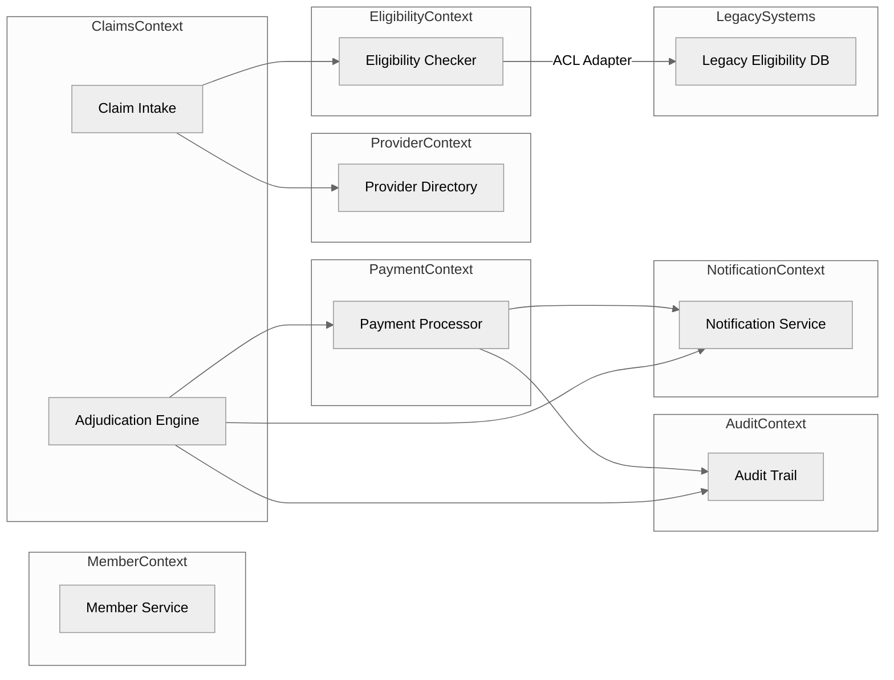
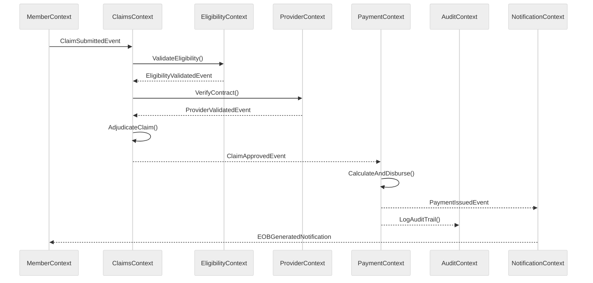

# Blue Cross – Health Insurance DDD Architecture

## 🧩 Domain-Driven Design Overview

This system models Blue Cross California’s health insurance operations using Domain-Driven Design (DDD).  
Each bounded context aligns with a business capability and owns its data, logic, and deployment pipeline.

**Bounded Contexts**
- MemberContext — enrollment, demographics, coverage.
- ProviderContext — doctor & hospital contracts.
- EligibilityContext — coverage validation.
- ClaimsContext — adjudication and benefit calculation.
- PaymentContext — disbursement & EOB creation.
- AuditContext — compliance trail.
- NotificationContext — alerts & communications.

## 🧭 Context Map

## ⚙️ Event Flow

