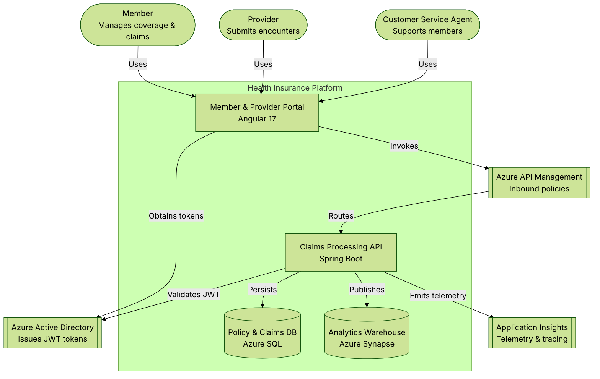
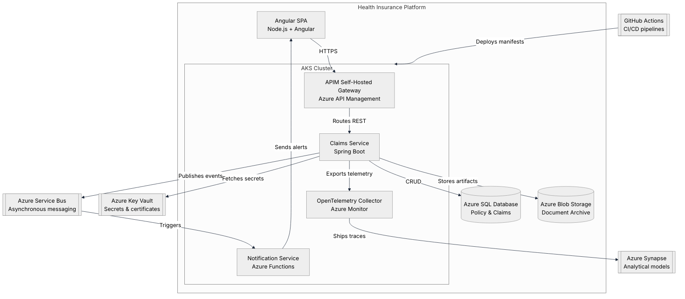
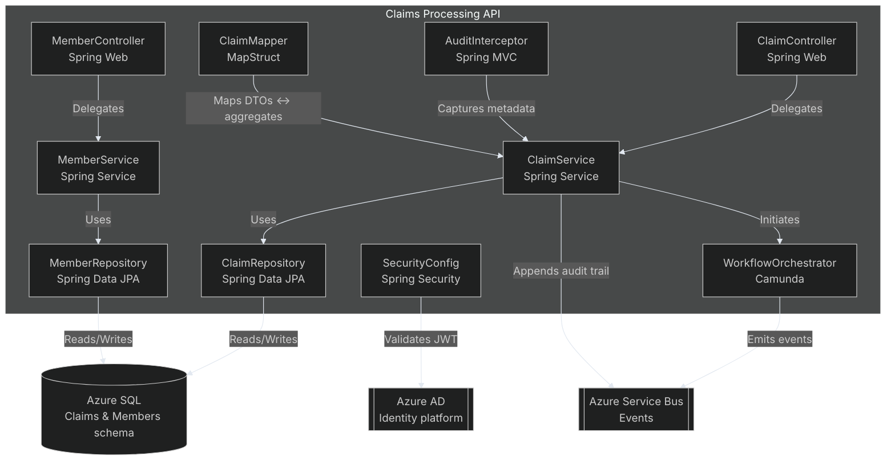
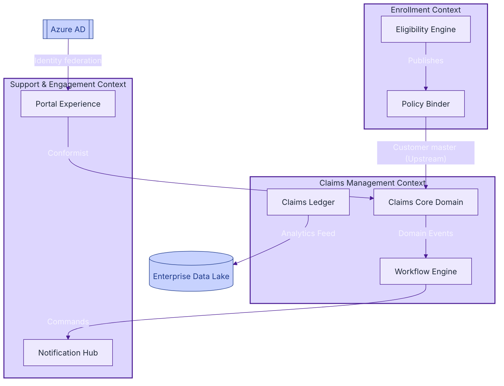

# Health Insurance Platform C4 Views

The following views capture the Health Insurance platform through the C4 lens, from the system context down to the Spring Boot API components. Each Mermaid diagram applies a rich theme so it can be embedded directly into other Markdown or documentation portals.

## Level 1 — System Context

### Reading the system context

1. **Start with personas.** Members, providers, and support agents all interact with the Angular portal over HTTPS.
2. **Follow authentication.** The portal secures requests by fetching JWTs from Azure Active Directory before calling downstream services.
3. **Observe governance.** Azure API Management enforces policies, throttling, and routing before forwarding requests to the Spring Boot API.
4. **Track data flows.** Core policy and claim records live in Azure SQL, while curated analytics feeds flow into Azure Synapse.
5. **Monitor operations.** Application Insights captures end-to-end telemetry to power diagnostics and SRE workflows.

## Level 2 — Container View

### Reading the container view

1. **Identify boundaries.** The SPA, AKS cluster, Azure SQL, and Blob Storage define the platform perimeter.
2. **Examine workload placement.** API management and core claims processing run in AKS, while event-driven notifications execute in Azure Functions.
3. **Trace persistence.** Claims data persists to Azure SQL, and claim attachments are archived in Blob Storage for compliance.
4. **Understand integrations.** Service Bus decouples claims events from downstream notifications and analytics workloads.
5. **Secure and observe.** Key Vault centralizes secrets, and the OpenTelemetry collector relays metrics and traces to Synapse-backed analytics.

## Level 3 — Component View (Claims API)

### Reading the component view

1. **Locate entry points.** `ClaimController` and `MemberController` expose REST endpoints for claims submission and member profile management.
2. **Follow service orchestration.** Services encapsulate domain logic and orchestrate workflows through Camunda-based state machines.
3. **Inspect persistence.** Repositories translate aggregates into SQL records while safeguarding transactional boundaries.
4. **Highlight cross-cutting concerns.** `SecurityConfig` enforces JWT validation, `AuditInterceptor` captures request metadata, and Service Bus receives domain events for downstream processing.
5. **Clarify mapping.** MapStruct centralizes conversions between DTOs, entities, and domain aggregates.

## DDD Context Map

### Reading the context map

1. **Bounded contexts.** Enrollment, Claims Management, and Support delineate distinct domain capabilities with minimal coupling.
2. **Upstream/downstream relationships.** Enrollment publishes policy data that the Claims context consumes in a conformist manner to ensure consistency.
3. **Event-driven choreography.** Claims domain events trigger workflow orchestration and downstream notifications.
4. **Shared data products.** The Claims ledger exports analytical feeds to the enterprise data lake without leaking core schemas.
5. **Identity alignment.** Azure AD centralizes identity for the portal, enabling consistent access controls across contexts.
