# 🧭 **Migration Execution Plan — Health Insurance Modernization**

**Program:** Legacy to Azure Cloud Modernization
**Domain:** Health Insurance (Claims, Member, Provider, Policy, Billing)
**Architecture:** DDD Microservices + API Gateway + Azure Data Platform
**Duration:** ~24 Months
**Methodology:** Agile (bi-weekly sprints per domain)

---

## 🏗️ **PHASE 0 — Discovery & Foundation (Month 0–3)**

| Activity                 | Description                                                        | Owner                | Deliverables                          | Checkpoints                      | Metrics                 |
| ------------------------ | ------------------------------------------------------------------ | -------------------- | ------------------------------------- | -------------------------------- | ----------------------- |
| System Inventory         | Catalogue all legacy modules (Claims, Member, Provider, Billing).  | Enterprise Architect | Legacy System Inventory Sheet         | 100% of legacy assets mapped     | # of apps inventoried   |
| Domain Decomposition     | Identify bounded contexts per DDD principles.                      | Solution Architect   | Context Map + Domain Ownership Matrix | Validated by business SMEs       | # of domains finalized  |
| Azure Landing Zone Setup | Create environments (Dev, QA, Prod), CI/CD, Key Vault, networking. | Cloud Infra Lead     | Azure Landing Zone Blueprint          | Security and compliance approved | % infra ready           |
| Data Audit               | Analyze mainframe data (schemas, volumes, dependencies).           | Data Architect       | Data Inventory & Schema Mapping       | Data dictionary published        | % data assets cataloged |
| Tooling Enablement       | Provision Azure DevOps, APIM, Databricks, Synapse, Event Hubs.     | Platform Engineer    | Tooling Readiness Report              | CI/CD pipelines operational      | % toolchain ready       |

✅ **Exit Criteria:**

* DDD context map approved.
* Azure landing zone live.
* All legacy systems inventoried.
* Key security services operational.

---

## ⚙️ **PHASE 1 — API Strangler Façade (Month 3–6)**

| Activity             | Description                                                             | Owner             | Deliverables                 | Checkpoints                  | Metrics               |
| -------------------- | ----------------------------------------------------------------------- | ----------------- | ---------------------------- | ---------------------------- | --------------------- |
| APIM Setup           | Configure API Management as façade in front of legacy.                  | API Lead          | APIM Gateway + Routing Rules | All endpoints reachable      | # APIs exposed        |
| Azure AD Integration | Enable JWT/OAuth2 token validation in APIM.                             | Security Engineer | Azure AD App Registration    | Authentication validated     | % endpoints secured   |
| Legacy Adapter       | Build REST layer over mainframe (CICS, DB2) for modern API consumption. | Integration Lead  | Mainframe Adapter Service    | End-to-end call works        | Response latency (ms) |
| Logging & Monitoring | Enable App Insights, Log Analytics, correlation IDs.                    | DevOps Engineer   | Unified Monitoring Dashboard | Logs visible in central view | % logs correlated     |
| Pilot Rollout        | Deploy “Eligibility” context first using façade.                        | Domain Owner      | MVP deployed                 | Pilot acceptance signed-off  | UAT success rate (%)  |

✅ **Exit Criteria:**

* APIM façade stable.
* Authentication flow verified.
* At least 1 domain live behind façade.

---

## 🧩 **PHASE 2 — Domain-by-Domain Migration (Month 6–12)**

| Activity                 | Description                                                             | Owner            | Deliverables                  | Checkpoints                    | Metrics                       |
| ------------------------ | ----------------------------------------------------------------------- | ---------------- | ----------------------------- | ------------------------------ | ----------------------------- |
| Context Prioritization   | Choose next 2–3 bounded contexts to migrate.                            | Product Owner    | Domain Migration Roadmap      | Reviewed by steering committee | Domain readiness score        |
| Service Development      | Build microservices per DDD boundaries (Spring Boot on AKS).            | Dev Team         | Service codebase + Swagger    | Integration tests passed       | # APIs implemented            |
| Event-driven Integration | Replace batch jobs with Event Hub-based pub/sub.                        | Integration Lead | Event Topics + Subscribers    | Events visible in logs         | Event throughput/sec          |
| Data Sync Bridge         | Use Data Factory + Databricks for bidirectional sync with mainframe DB. | Data Engineer    | ETL Jobs + Delta Lake Staging | Sync lag < 2 hrs               | Sync latency (mins)           |
| Consumer Cutover         | Update Angular SPA to call new microservices.                           | Frontend Lead    | New API routes in SPA         | No UI regression               | % requests served by new APIs |

✅ **Exit Criteria:**

* ≥3 domains migrated (Member, Provider, Claims).
* Events flowing to Azure Event Hub.
* Data sync verified both directions.

---

## 🧮 **PHASE 3 — Data Modernization (Month 12–18)**

| Activity                  | Description                                                      | Owner           | Deliverables                     | Checkpoints                | Metrics              |
| ------------------------- | ---------------------------------------------------------------- | --------------- | -------------------------------- | -------------------------- | -------------------- |
| Raw Zone Migration        | Move all data exports to ADLS /raw via ADF.                      | Data Engineer   | Data Lake /raw zone              | Data landed daily          | Data freshness (hrs) |
| Delta Lake ETL            | Transform data into Bronze/Silver/Gold tables.                   | Databricks Lead | ETL notebooks + Delta jobs       | Jobs scheduled via ADF     | Job success rate (%) |
| Synapse Integration       | Expose Gold layer via Synapse serverless SQL.                    | BI Lead         | Synapse Views + Power BI Dataset | Reports render correctly   | Query latency (ms)   |
| Purview Governance        | Scan and catalog all data assets.                                | Governance Lead | Purview lineage map              | Lineage verified           | % assets classified  |
| Validation & Decommission | Validate row-level parity, decommission mainframe batch exports. | Data Architect  | Validation report                | Cutover readiness approved | % parity achieved    |

✅ **Exit Criteria:**

* All batch ETL flows in ADLS/Delta.
* Power BI reports point to new source.
* Legacy batch jobs retired.

---

## 🚀 **PHASE 4 — Full Cutover & Optimization (Month 18–24)**

| Activity                 | Description                                     | Owner              | Deliverables               | Checkpoints               | Metrics              |
| ------------------------ | ----------------------------------------------- | ------------------ | -------------------------- | ------------------------- | -------------------- |
| Routing Cutover          | All APIs now point to microservices.            | API Lead           | APIM routing table updated | All routes validated      | # endpoints cutover  |
| Mainframe Read-only      | Lock mainframe as backup only.                  | Ops Lead           | Mainframe freeze plan      | Access limited            | % traffic off legacy |
| Resiliency Improvements  | Introduce retries, circuit breakers, caching.   | Dev Team           | Resilience4j config        | Load test passed          | p95 latency (ms)     |
| Monitoring Consolidation | Unified dashboards for API, AKS, and Data Lake. | DevOps Lead        | Azure Monitor workbook     | Dashboard reviewed weekly | Alert coverage (%)   |
| Compliance Audit         | HIPAA/PHIPA readiness validation.               | Compliance Officer | Audit package              | External signoff          | # findings resolved  |

✅ **Exit Criteria:**

* Legacy turned read-only.
* All services fully operational in Azure.
* Compliance approval received.

---

## 📈 **PHASE 5 — Continuous Improvement (Post Go-Live)**

| Activity                  | Description                                | Owner             | Deliverables         | Checkpoints                | Metrics                      |
| ------------------------- | ------------------------------------------ | ----------------- | -------------------- | -------------------------- | ---------------------------- |
| Feedback Loop Integration | ML models feed predictions back to APIs.   | Data Science Lead | Fraud detection API  | ML in production           | # models deployed            |
| Cost Optimization         | Analyze and tune cloud usage.              | FinOps Lead       | Cost dashboards      | 10% monthly cost reduction | % budget variance            |
| CI/CD Enhancements        | Automate deployments and rollback testing. | DevOps Lead       | Blue-Green pipeline  | Deployment success rate    | # of rollbacks               |
| Continuous Compliance     | Auto-scan via Purview and Defender.        | Governance Lead   | Compliance dashboard | Weekly scans               | # of open alerts             |
| Retrospective Review      | Lessons learned and next phase roadmap.    | PMO               | Closeout report      | Sign-off by leadership     | Stakeholder satisfaction (%) |

✅ **Exit Criteria:**

* Stable post-migration system.
* Continuous compliance & optimization in place.
* Business users using modern dashboards.

---

## 📊 **Monitoring Metrics Dashboard (for PMO)**

| Category                       | KPI                                  | Target   |
| ------------------------------ | ------------------------------------ | -------- |
| **Migration Velocity**         | # of domains migrated per quarter    | ≥2       |
| **Data Quality**               | Record parity between legacy and new | ≥99.5%   |
| **API Availability**           | Uptime for critical APIs             | ≥99.9%   |
| **Data Pipeline Success Rate** | % of scheduled jobs completed        | ≥98%     |
| **Security Compliance**        | % endpoints with AAD auth enforced   | 100%     |
| **Cost Efficiency**            | Cost reduction vs legacy ops         | ≥20% YoY |
| **User Adoption**              | % users accessing modern UI/API      | ≥90%     |

---

## 🧠 **Summary View**

```mermaid
timeline
    title Migration Execution Roadmap
    section Foundation
      Q1–Q2 2025 : Discovery • DDD Context Mapping • Azure Landing Zone
    section API Strangulation
      Q3 2025 : APIM Façade • AAD Integration • Legacy Adapter
    section Domain Migration
      Q4 2025 – Q1 2026 : Microservices Rollout • Event Hubs Integration
    section Data Modernization
      Q2 2026 : ADLS + Databricks + Synapse
    section Cutover & Optimization
      Q3 2026 : Decommission Legacy • Optimize • Audit
    section Continuous Improvement
      Q4 2026+ : ML Feedback Loop • Cost Optimization • Compliance Automation
```

---
