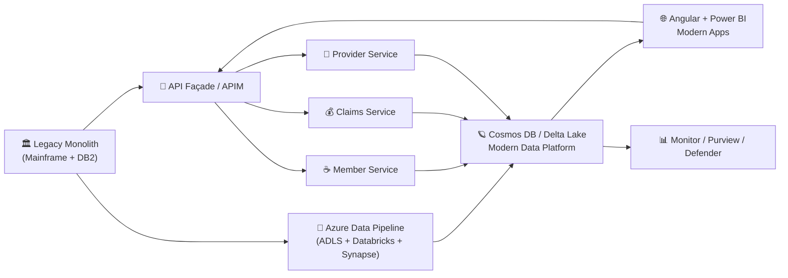

# 🧭 **Migration Strategy for Health Insurance Modernization**

### 🎯 **Goal**

Migrate from a **monolithic legacy mainframe application** to a **cloud-native, domain-driven architecture** on Azure — with microservices, event-driven APIs, and a unified data pipeline — while ensuring business continuity, data integrity, and regulatory compliance (HIPAA, PHIPA, SOC2).

---

## 🏗️ **PHASE 0 — Foundation & Assessment (0–3 Months)**

| Focus                      | Description                                                                                  | Deliverables                 |
| -------------------------- | -------------------------------------------------------------------------------------------- | ---------------------------- |
| **System Inventory**       | Catalogue legacy modules (Claims, Policy, Members, Billing, Provider Mgmt).                  | System decomposition map.    |
| **Domain Modelling**       | Apply **DDD** — identify **bounded contexts** (e.g., Claims, Eligibility, Member, Payment).  | Context map + relationships. |
| **Tech Baseline**          | Stand up Azure environments: Dev, QA, Prod. Set up VNETs, Key Vault, Monitor, ADO Pipelines. | Landing zone + CI/CD.        |
| **Data Audit**             | Analyze mainframe datasets, interfaces, and dependencies. Identify master data ownership.    | Data lineage + dictionary.   |
| **Change Management Plan** | Define training, communication, and user-impact strategy.                                    | Communication plan.          |

✅ **Outcome:** Migration roadmap + prioritized contexts + secured Azure base ready for first services.

---

## ⚙️ **PHASE 1 — Strangulation via API Layer (3–6 Months)**

| Focus                    | Description                                                                                   | Deliverables                   |
| ------------------------ | --------------------------------------------------------------------------------------------- | ------------------------------ |
| **Strangler Pattern**    | Introduce **API façade** (Spring Boot + APIM) in front of legacy.                             | APIM gateway + routing rules.  |
| **Token-based Security** | Integrate **Azure AD / B2C** for unified login.                                               | OAuth2 / JWT flow established. |
| **Parallel Access**      | Modern APIs read data from legacy DB via staging or APIs.                                     | Hybrid API endpoints.          |
| **Event Hub Bridge**     | Publish key events (claim created, member updated) to Azure Event Hubs for new microservices. | Event-driven integration.      |

✅ **Outcome:** New APIs coexist with legacy, establishing a migration “control plane” without touching core yet.

---

## 🧩 **PHASE 2 — Incremental Domain Carve-Out (6–12 Months)**

| Focus                         | Description                                                                            | Deliverables                      |
| ----------------------------- | -------------------------------------------------------------------------------------- | --------------------------------- |
| **Bounded Context Isolation** | Gradually extract one domain at a time (e.g., **Member** → **Provider** → **Claims**). | Independent service per context.  |
| **Data Synchronization**      | Use the **Azure Data Pipeline** (ADLS + Databricks) for two-way sync with mainframe.   | ETL & CDC bridge.                 |
| **New Service Deployment**    | Deploy each microservice independently in **AKS / App Service**.                       | Domain microservices (DDD-based). |
| **Integration Contracts**     | Establish **OpenAPI specs** + versioned endpoints for each domain.                     | Swagger contracts in APIM.        |
| **Event-driven Coupling**     | Use **Event Hubs / Service Bus** for async communication (e.g., claim status updates). | Pub/Sub integration.              |

✅ **Outcome:** Domains move off the monolith while data consistency is maintained through sync jobs and event streams.

---

## 🧮 **PHASE 3 — Data Modernization & Master Migration (12–18 Months)**

| Focus                              | Description                                                          | Deliverables                                |
| ---------------------------------- | -------------------------------------------------------------------- | ------------------------------------------- |
| **Delta Lake as System of Record** | Promote **ADLS + Delta Lake** to central source for analytical data. | Unified data lake (bronze → silver → gold). |
| **Operational Data Shift**         | Move real-time workloads to **Cosmos DB** and APIs.                  | Real-time data access layer.                |
| **Data Validation**                | Compare migrated vs legacy datasets (row counts, checksums).         | Data quality reports.                       |
| **Decommission Legacy Tables**     | Gradually shut down mainframe database tables post validation.       | DB decommission plan.                       |
| **Reporting Alignment**            | Switch BI tools (Power BI / Synapse) to read from new data sources.  | Cutover for analytics.                      |

✅ **Outcome:** Modern data backbone becomes live; mainframe starts acting as read-only backup.

---

## 🚀 **PHASE 4 — Full Cutover & Optimization (18–24 Months)**

| Focus                          | Description                                                               | Deliverables                          |
| ------------------------------ | ------------------------------------------------------------------------- | ------------------------------------- |
| **Complete Domain Migration**  | All domains now service-based with DDD boundaries.                        | 100% traffic routed to microservices. |
| **Legacy Decommissioning**     | Switch off batch exports, mainframe job schedules, old APIs.              | Shutdown checklist.                   |
| **Performance Tuning**         | Enable caching (Redis), scaling (AKS HPA), and resiliency (Resilience4j). | Performance metrics.                  |
| **Monitoring & Observability** | Unified dashboards via Azure Monitor + App Insights + Log Analytics.      | Central observability platform.       |
| **Governance & Compliance**    | Final Purview lineage scans, Key Vault rotation, audit-ready logs.        | Compliance certification.             |

✅ **Outcome:** Fully modernized, API-first, event-driven, cloud-native platform on Azure.

---

## 📈 **PHASE 5 — Continuous Improvement & Intelligence (Ongoing)**

| Focus                         | Description                                                                               |
| ----------------------------- | ----------------------------------------------------------------------------------------- |
| **Feedback Loop Integration** | Feed analytics & ML predictions back into microservices (e.g., fraud risk → claims API).  |
| **Advanced Data Science**     | Build ML models in Databricks / AML for risk scoring, utilization forecasts.              |
| **Automation**                | Self-healing pipelines, IaC (Terraform), continuous deployments via GitHub Actions / ADO. |
| **Governance Maturity**       | Auto-lineage tracking, automated PII scanning via Purview.                                |

---

## 🧠 **Key Migration Principles**

| Area                            | Best Practice                                                                       |
| ------------------------------- | ----------------------------------------------------------------------------------- |
| **1️⃣ Data Consistency**        | Run dual writes during transition (legacy + modern DBs) until validation completes. |
| **2️⃣ Strangler Fig Pattern**   | Gradually reroute APIs from legacy to new microservices one domain at a time.       |
| **3️⃣ Event-first Integration** | Use Event Hubs or Service Bus to decouple new systems from old batch syncs.         |
| **4️⃣ Domain-first Priority**   | Migrate low-risk, high-ROI domains first (e.g., Provider, Eligibility).             |
| **5️⃣ Compliance by Design**    | Every pipeline includes lineage, masking, and auditing.                             |
| **6️⃣ CI/CD Everything**        | Automated deploys with rollback capabilities.                                       |

---

## 🧩 **Visual — Modernization Roadmap Overview**

---

## ⚡ **Risk Mitigation Checklist**

✅ **Run in Parallel:** Keep old and new systems live during migration.
✅ **Data Validation Scripts:** Compare row-level and checksum validation post-migration.
✅ **Rollout by Domain:** Claims → Member → Provider → Payments.
✅ **Feature Flags:** Control cutover safely for specific features.
✅ **Audit & Backups:** Always retain legacy extracts in `/archive/mainframe`.

---
