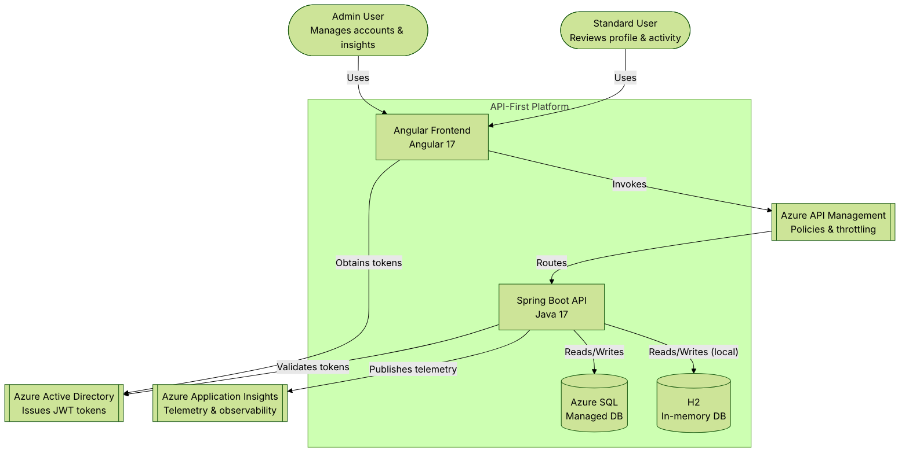
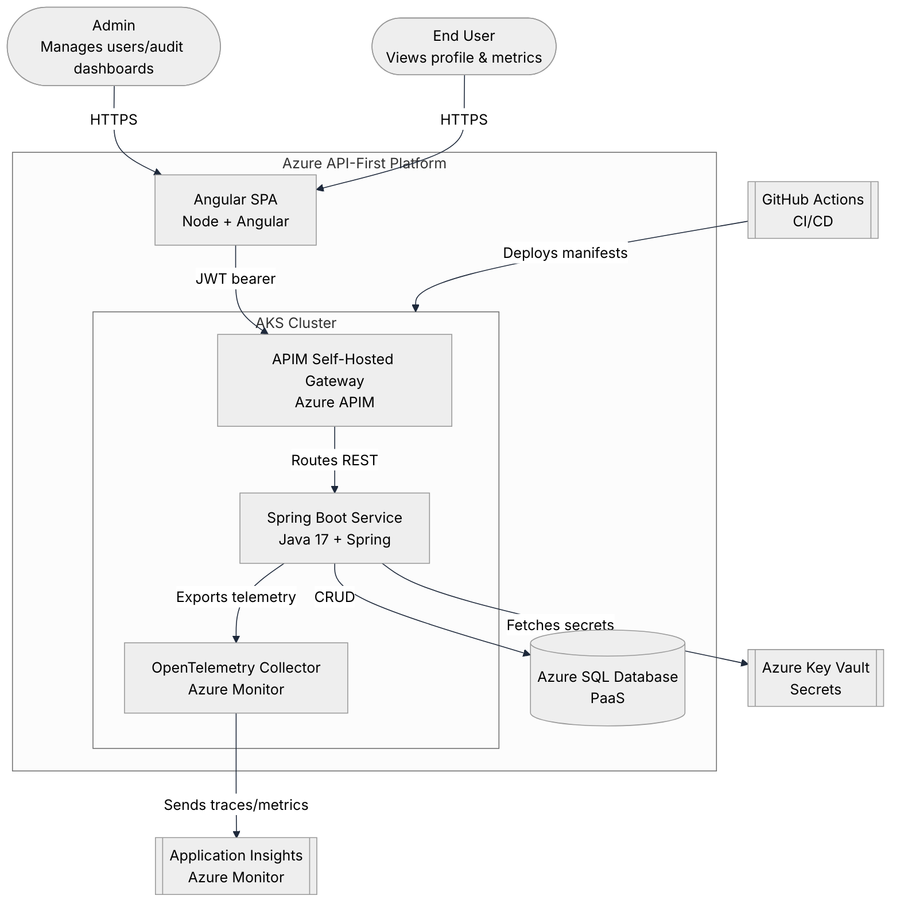
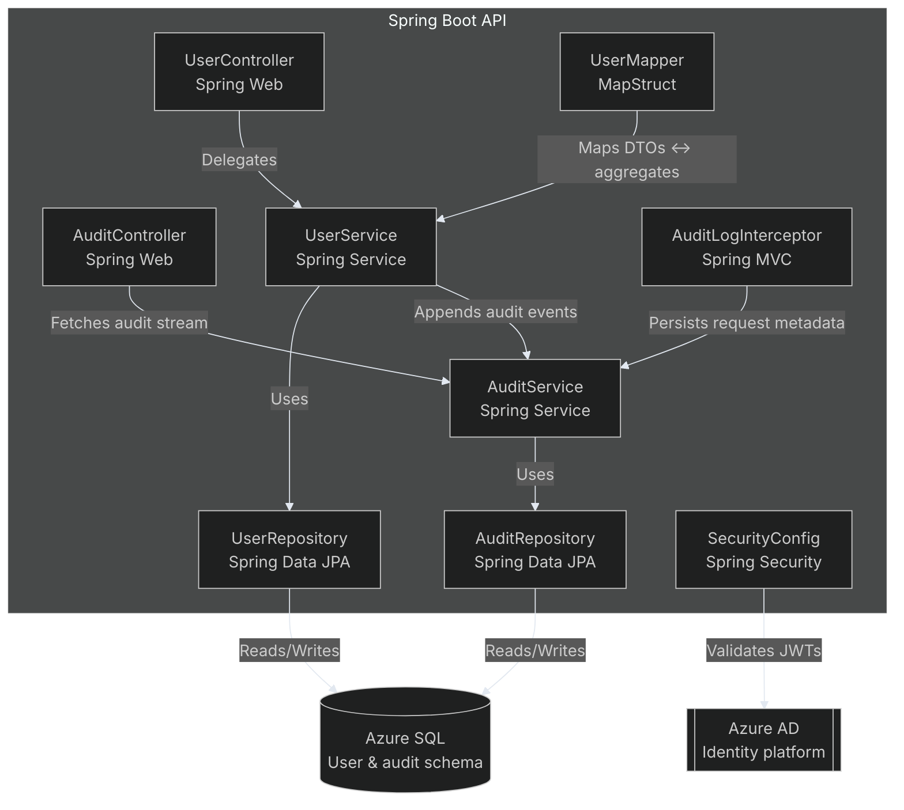
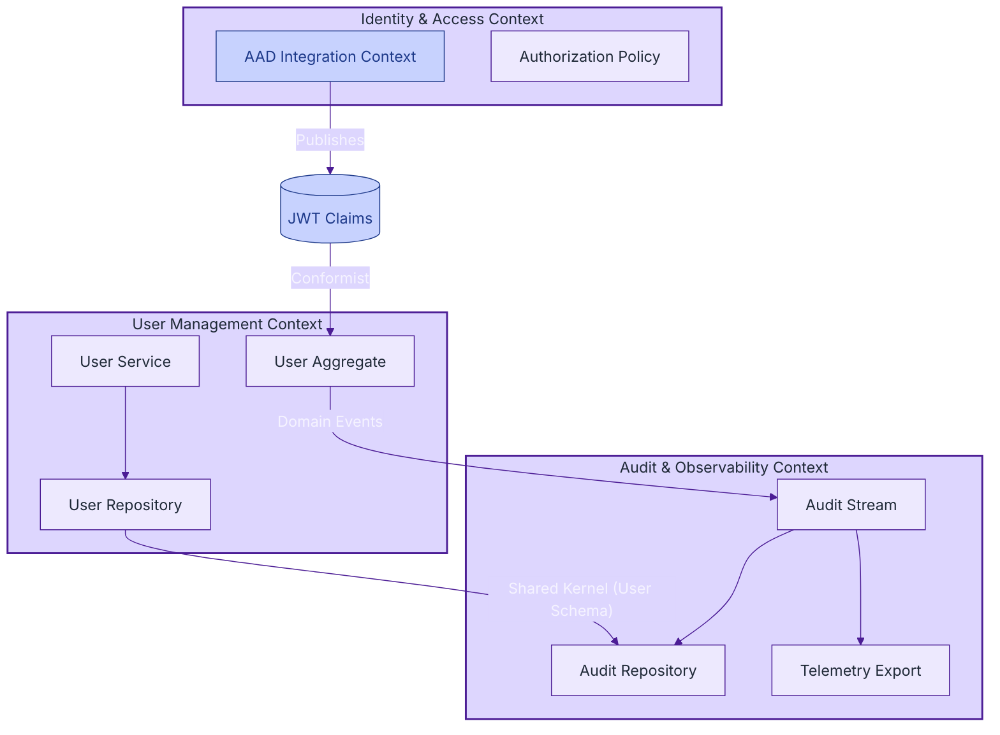
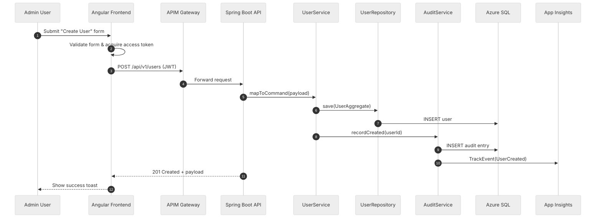

# Architecture Diagrams

This document captures C4-style architecture views and Domain-Driven Design (DDD) bounded contexts for the Azure API-first microservices proof of concept. All diagrams are rendered with Mermaid so they can evolve alongside the codebase.

## Level 1 — System Context

### How to read this diagram

1. **Identify the primary actors.** Start with the two user personas on the left—Admin and Standard User. Each persona interacts with the Angular single-page application (SPA) over HTTPS.
2. **Follow authentication flows.** The SPA requests tokens from Azure Active Directory (Azure AD), which issues JWTs that will later be validated by the API.
3. **Trace API traffic.** User traffic enters Azure API Management (APIM), which enforces policies and throttling before routing requests to the Spring Boot API.
4. **Inspect data persistence.** The API reads and writes business data to Azure SQL in production and to an in-memory H2 database for local development.
5. **Observe telemetry.** Every API interaction emits telemetry to Azure Application Insights so that engineering and operations teams can monitor the system.

## Level 2 — Container View

### How to read this diagram

1. **Start at the platform boundary.** The SPA, AKS cluster, and Azure SQL database make up the Azure API-first platform. The SPA communicates with the backend services through standard HTTPS calls.
2. **Examine cluster responsibilities.** Inside the AKS cluster, the APIM self-hosted gateway receives requests, the Spring Boot service processes them, and the OpenTelemetry collector ships telemetry to Azure Monitor.
3. **Review external dependencies.** Application Insights captures traces and metrics, Azure Key Vault stores secrets, and GitHub Actions deploys Kubernetes manifests.
4. **Understand user interaction.** Both the admin and end user reach the SPA over HTTPS, which in turn uses JWT bearer tokens to call the gateway.
5. **Follow data and secret flows.** The Spring Boot service persists state in Azure SQL and securely retrieves configuration from Key Vault.

## Level 3 — Component View (Spring Boot API)

### How to read this diagram

1. **Locate entry points.** User-facing requests arrive at `UserController` or `AuditController`, implemented with Spring Web.
2. **Follow service orchestration.** Each controller delegates to its respective service layer (`UserService` or `AuditService`), which contains the core business logic.
3. **Trace persistence operations.** Services rely on repositories backed by Spring Data JPA to interact with Azure SQL, ensuring consistent data access patterns.
4. **Note cross-cutting concerns.** `SecurityConfig` validates JWT tokens against Azure AD, while `AuditLogInterceptor` records request metadata for observability.
5. **Understand data transformations.** `UserMapper` uses MapStruct to convert between transport-layer DTOs and domain aggregates, keeping mapping logic centralized.

## DDD Context Map

### How to read this diagram

1. **Identify bounded contexts.** Three contexts—Identity & Access, User Management, and Audit & Observability—each own their domain models and responsibilities.
2. **Study integrations.** The Identity context publishes JWT claims that the User Management context consumes in a conformist relationship, aligning authorization requirements.
3. **Trace domain events.** The User Aggregate emits domain events to the Audit Stream, which both stores audit records and exports telemetry.
4. **Observe shared data contracts.** The User Repository and Audit Store share a kernel around the user schema to guarantee consistent representations of user data across contexts.
5. **Assess policy placement.** Authorization policies reside in the Identity context, making it clear where access control rules are defined.

## Use Case Sequence — "Create User"

### How to read this diagram

1. **Initiate the workflow.** The admin user submits the "Create User" form from the Angular frontend, which validates input and acquires an access token.
2. **Follow the API call.** The SPA sends an authenticated POST request through APIM, which forwards it to the Spring Boot API.
3. **Trace command handling.** The API maps the payload into a command object and invokes `UserService`, which persists the `UserAggregate` via `UserRepository`.
4. **Record auditing actions.** `UserService` triggers `AuditService` to write an audit entry and emit a telemetry event to Application Insights.
5. **Return the response.** The API responds with `201 Created`, the SPA relays success feedback to the admin, and telemetry confirms the operation completed.

These diagrams can be copied into documentation portals or Azure DevOps wikis to communicate the system from multiple viewpoints.
