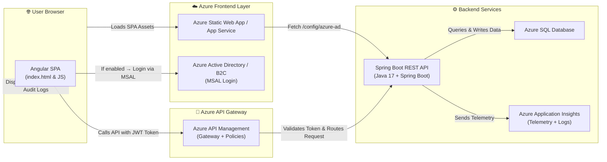

Perfect 👏 — here’s your **Mermaid diagram** showing the full **Angular SPA + Azure API + Authentication flow**, exactly matching your POC architecture.

---

### 🧩 **Mermaid Diagram: Angular SPA in Azure Context**

---

### 🧠 **How to Read This**

1️⃣ User opens your **Angular SPA** (hosted on Static Web Apps or App Service).
2️⃣ SPA fetches `/config/azure-ad` from backend to see if AAD is enabled.
3️⃣ If yes → SPA uses **MSAL** to redirect user to **Azure AD** for sign-in.
4️⃣ Upon success → gets **JWT token** for API access.
5️⃣ SPA calls your **Spring Boot API** through **Azure API Management**, passing the JWT.
6️⃣ **APIM** validates and routes the request.
7️⃣ **Spring Boot API** accesses **Azure SQL** and sends **logs/metrics** to **Application Insights**.
8️⃣ SPA displays updated data (users, audits, health status).

---

Would you like me to generate a **second version of this diagram** that’s **animated** (Framer Motion + Mermaid style, for CodeX demo)**—so each step fades in sequentially during your presentation?
