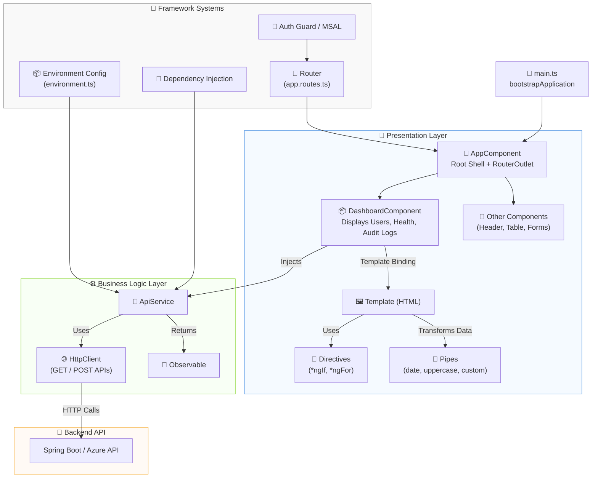

### 🧩 **Mermaid Diagram: Core Angular Architecture Flow**

---

Perfect — your explanation is already excellent; we just need to **fix the layout** and make each point clearly separated (new line for every step) so it’s visually easy to follow.

Here’s a polished, **Markdown-ready “How to Read It”** section for your Core Angular Architecture Flow 👇

---

### 🧠 **How to Read It**

1️⃣ **`main.ts`** bootstraps your Angular app (standalone mode).  
2️⃣ **`AppComponent`** is the root shell hosting a `<router-outlet>`.  
3️⃣ **Routes** (`app.routes.ts`) decide which component (e.g., `DashboardComponent`) loads.  
4️⃣ Each component has:

* a **Template (HTML)** with Angular **Directives** & **Pipes**,
* an injected **Service (`ApiService`)** to fetch data.  
  
5️⃣ **`ApiService`** uses **`HttpClient`** to call your backend API (Spring Boot / Azure API).  
6️⃣ Responses come back as **Observables**, which the component subscribes to and binds in the UI.  
7️⃣ **Dependency Injection**, **Routing**, **Auth Guards**, and **Environment Configs** tie the system together. 

---

