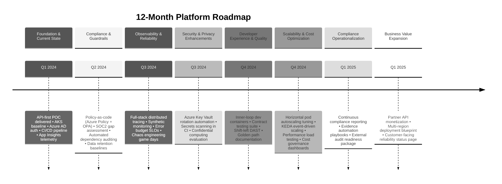

# Azure API-First POC Roadmap

This roadmap highlights what has been accomplished so far and outlines the next twelve months of investment across compliance, observability, security, developer productivity, and scalability. The timeline is grouped into quarterly milestones to keep the proof-of-concept aligned with business outcomes and platform maturity goals.

## Roadmap Themes

- **Compliance & Risk:** Establish policy-as-code, automate evidence collection, and validate readiness for SOC2/ISO controls.
- **Observability & Reliability:** Expand monitoring across the stack, adopt error budgets, and rehearse failure scenarios.
- **Security & Privacy:** Automate secrets management, integrate advanced scanning, and evaluate confidential computing for sensitive workloads.
- **Developer Experience:** Streamline local development, enforce contract-driven testing, and provide actionable documentation.
- **Scalability & Cost:** Right-size infrastructure, implement event-driven scale-out, and introduce continuous performance testing.
- **Business Outcomes:** Enable monetization pathways, provide transparency to customers, and prepare for regional expansion.

Each milestone feeds the next: compliance guardrails unlock enterprise onboarding, deeper observability supports SLO commitments, and developer tooling accelerates delivery without sacrificing governance.
